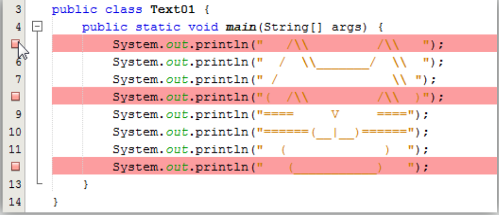
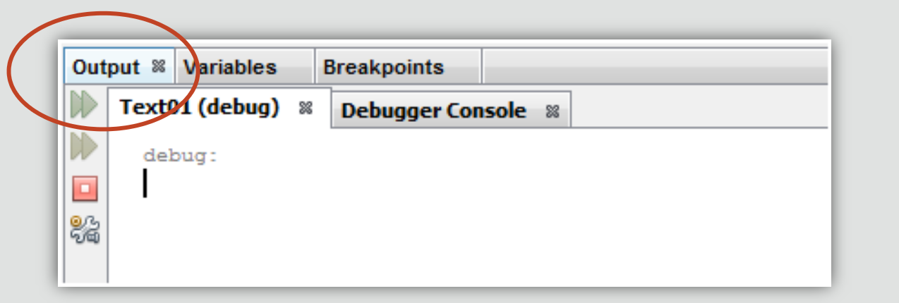
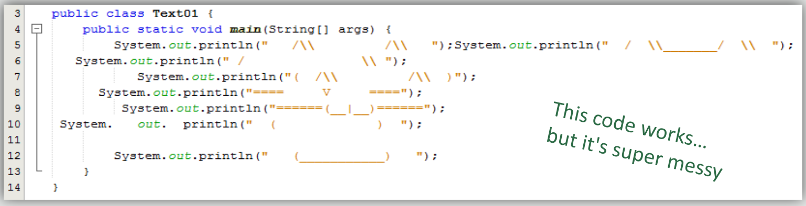
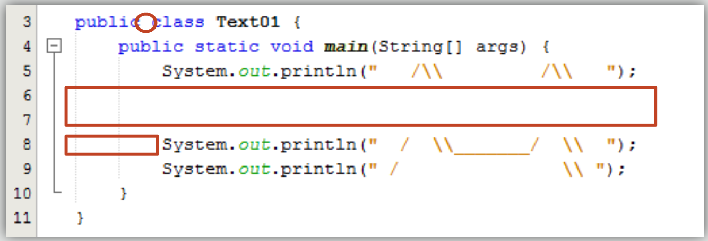
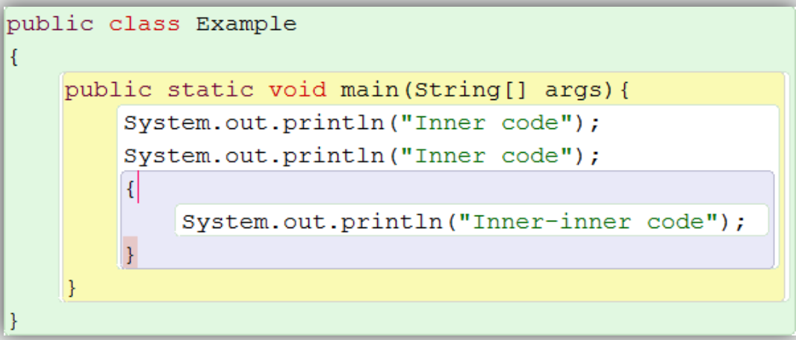
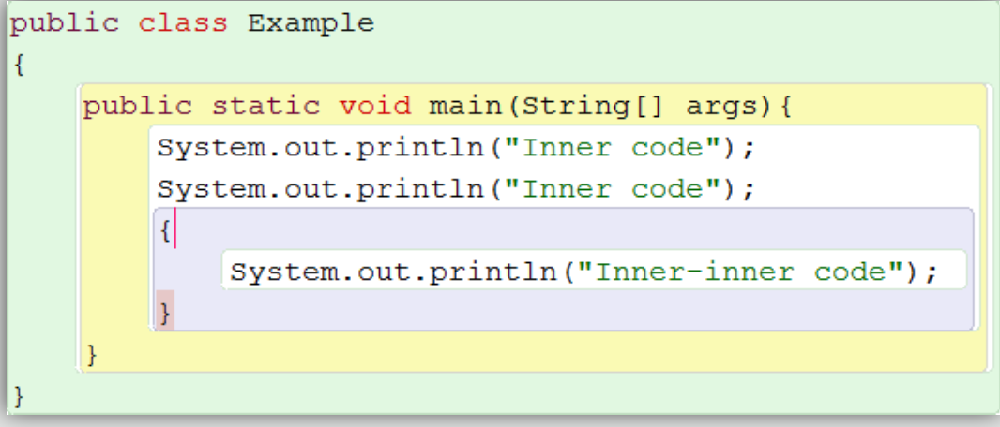
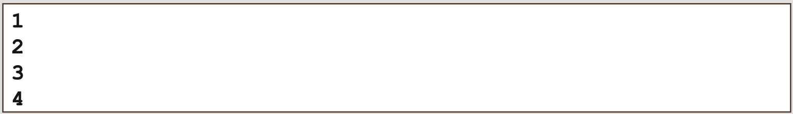
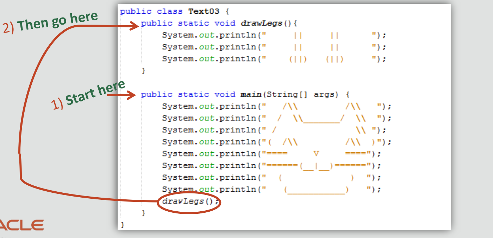

#  Java Foundations 2-2 What is my Program Doing?

##Objectives

* **This lesson covers the following objectives:**

  - Understand how Java is read line by line
  - Set and use breakpoints
  - End statements with semicolons (;)
  - Organize code using whitespace and other conventions 
  - Create comments
    
## Reading a Program Line by Line

* **Each line in a program is read one at a time**

1. ``System.out.println("Line 1");``
2. ``System.out.println("Line 2");``
3.  ``System.out.println("Line 3");``
4.  ``System.out.println("Line 4");``
5.  ``System.out.println("Line 5");``

* **In the example...**

  - Line 1 is read... 
  - Then Line 2...
  - Then Line 3... 
  - Then Line 4... 
  - Then Line 5...
    
## Reading Line by Line

* **Java is mostly read line by line**
* **But there are a few additional points to consider**
* **We’ll investigate using...**
  - A breakpoint 
  - Other features of NetBeans
    
## Breakpoints
* **Set a breakpoint in your code to**
   
  - Pause code execution
  - Check the current state of the program 
  - Help debug
    
* **Breakpoints affect code execution ...**

  - When code is run with the debugger
    
* **Breakpoints can’t affect code execution ...**

  - When code is run normally
    
## Setting a Breakpoint Animation
* **To set a breakpoint ...**

  - Place your cursor over a number in the left margin 
  - Click ... and you have a breakpoint!
  - Click again to remove a breakpoint 
  - You can set many breakpoints

## Exercise 1, Part 1

* **Import and open the Text01 project**
* **Set a breakpoint at Line 5 (the line with the first print statement)**
* **Run the program normally**

  - Breakpoints should have no affect
    
## Exercise 1, Part 2
* **Run the program with the debugger:**
   
   - Make sure the Output window is showing 
   - Press Step Over to go to each next line
    
* **Observe the cat appear one line at a time**

## Exercise 1, Part 3
* **Modify the code so that the first three print statements all appear on Line 5 (This is called removing whitespace)**
* **Run the program with the debugger:**

  - Make sure the Output window is showing
  - Press Step Over Expression to go to each next line 
  - Ignore the complicated code at the end of debugging
    
* **Observe the cat appear one line at a time**
* **Try removing a semicolon while debugging the
  Step Over Expression
  program**
  
## Investigation Results, Part 1
* **You could say Java reads code line by line ...**
* **But if multiple statements are on a single line, it’s more
  accurate to say Java reads statement by statement**
* **A semicolon (;) is required to end a statement**  
   
   - Forgetting a semicolon is a common mistake
   - Other languages (Python) may not care about semicolons
    ``System.out.println("Meow");``
     
* **Editing code has no affect while the program is running**
* **You must recompile for changes to take affect**

## Investigation Results, Part 2

* **Java isn’t precise about whitespace**
* **Other languages (Python) may be extremely precise**
* **You could write an entire program in a single line**
  
  - But this is messy and almost impossible to work with 
  - Use whitespace to keep code organized

## Whitespace
* **Whitespace is any spacing without code:**

   - Space between words
   - Blank lines
   - Indentation before a line of code

## Effects of Whitespace
* **Whitespace helps keep code organized**
* **Whitespace doesn’t affect how code runs**
* **You can use whitespace however you prefer**
* **But proper indentation is strongly encouraged because it ...**

  - Prevents readability difficulties 
  - Prevents mistakes while programming
    
## Indentation and Curly Braces
* **Indent by an additional tab (4 spaces) following an
  opening curly brace ( { )**
  
* **Stop indenting by an additional tab (4 spaces) prior to
  a closing curly brace ( } )**
  
* **Code within curly braces is called a block of code**
  
  - When you add an opening curly brace ( { ) ... 
  - You’ll eventually need a closing curly brace ( } ) 
  - Mismatching or forgetting a curly brace is a common mistake
    
## Block Example

_These curly braces also create a block within a block.... Whose code is indented further_

## IDE Indentation Assistance

* **An IDE may...**

  - Color-code the scope of a block (Greenfoot, BlueJ)
  - Automatically indent following a curly brace 
  - Highlight a matching curly brace (shown below)
    
* **Some Java commands require curly braces, although you can always add more**
  
  
## Exercise 2
* **Import and open the Text02 project**
* **Can you fix this program and produce the following output?**

* **Hints:**
   
   - NetBeans underlines problematic code
   - NetBeans can highlight matching curly braces
   - NetBeans has a shortcut to format whitespace (Alt+Shift+F)
    
## Comments
* **Neatly spaced programs can grow large and become difficult to read**
* **You can add comments to code to ...**
   
   - Provide an explanation or additional information to the
     programmer (Commenting code)
   - Disable code and prevent it from executing without erasing it (Commenting out code)

## Reading Line by Line
* **We can do a little more investigating**
* **We’ll investigate using ...**

  - Code blocks
  - Comments
  - Breakpoints 
  - Other features of NetBeans
    
## Exercise 3
* **Import and open the Text03 project**
* **Set a breakpoint at Line 11**
* **Run the program with the debugger:**
   
   - Be sure to have the Output window selected 
   - Press Step Over to go to each next line
    
* **Observe the cat face appear, but the legs don’t appear**
* **Type drawLegs(); in Line 19 and debug the program**

  - Where could you add a breakpoint to see the legs drawn one
    line at a time?
  - What happens to the output when lines are commented out?
    
## Investigation Results, Part 3
* **When Java reads line by line ...**
* **It starts within the special block of code known as the main method**

``public static void main(String[] args){ }//end method main``

* **No other code executes unless it’s called**
  
   - In this exercise, the main method must specifically call the
     block of code that prints legs
* **Commented code is ignored**
   
   - Comments are removed in bytecode
    
## The Program’s Flow
1. All Java programs start in the main method
2. No other code executes unless it’s called

## The Main Method
* **The main method is a special block of code**
* **All Java programs start in the main method**
* **Your programs should have only 1 main method**
* **Methods are discussed more in the next lesson**
  
   - drawLegs() is an example of a method
    
``public static void main(String[] args){
//Your program starts here
}//end method main``

## Summary
* **Common mistakes:**
  - Missing semicolon (;)
    
    ``System.out.println("Meow")``
  - Mismatched {curly braces}  
    ``{ System.out.println("Meow");``
   
* **Keep code organized using:** 
   
   -  Whitespace
   -  Curly Braces ( { } )
   -  Comments
    
## Summary
* **In this lesson, you should have learned how to:**
  
   - Understand how Java is read line by line
   - Set and use breakpoints
   - End statements with semicolons (;)
   - Organize code using whitespace and other conventions 
   - Create comments
    
## Reference Materials
[Text01.zip](https://myacademy.oracle.com/lmt/clmafileupload.prFormaction?in_sessionid=15420JJ094J3A210&in_actionDisplay=Display&in_file_id=35363&in_object_id=71232422&in_object_type=RM)

[Text02.zip](https://myacademy.oracle.com/lmt/clmafileupload.prFormaction?in_sessionid=15420JJ094J3A210&in_actionDisplay=Display&in_file_id=35364&in_object_id=71232424&in_object_type=RM)

[Text03.zip](https://myacademy.oracle.com/lmt/clmafileupload.prFormaction?in_sessionid=15420JJ094J3A210&in_actionDisplay=Display&in_file_id=35365&in_object_id=71232577&in_object_type=RM)
  
  

