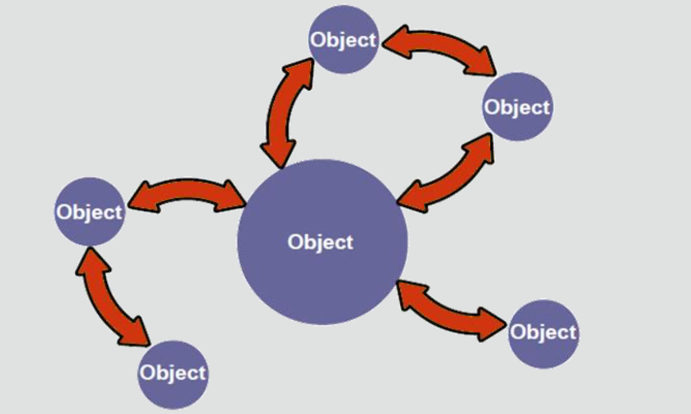

# Java Foundations 2-3 Introduction to Object-Oriented Programming Concepts

## Objectives
* **This lesson covers the following objectives:**

  - Differentiate between procedural and object-oriented programming
  - Understand a class as a blueprint for an object
  - Understand a class is used to create instances of an object
  - Model objects as a combination of ...
     
    - Properties (data fields)
    - Behaviors (methods)
    
## Review
* **So far, we've taken ...**
   
    - Decades of computer science innovation 
    - Gigabytes of modern computing power
    
* **And much like the Internet ...**
   
   - We've made a cat!
    
## Java Can Do More!
* **Procedural languages ...**

  - Read one line at a time 
  - The C language is procedural
* **Object-oriented languages...**
   
  - Read one line at a time
  - Model objects through code
  - Emphasize object interaction
  - Allow interaction without a prescribed order −Java and C++ are object-oriented languages
    
## Object-Oriented Programming
* Interaction of objects
* No prescribed sequence

## Exercise 1
* **Play Basic Puzzles 1 through 5**
 
  - Your Goal: Design a solution that deflects the ball to Duke
    
* **Consider the following:**

  - What objects do you find on the field of play?
  - What happens when you put a triangle wall or simple wall icon on the blue wheel?
    
## About Java Puzzle Ball
* Play a set of puzzles
* Become familiar with the game mechanics
* Consider questions as you play
* Listen to the lesson's debriefing on what you’ve observed 
* Apply your observations to understand Java concepts

_This game reflects Java concepts through game mechanics. It’s more important to become familiar with these mechanics than it is to solve every puzzle. Don’t worry if the connection between game mechanics and Java concepts isn't immediately apparent. We’ll debrief you afterward. People tend to realize the connection during this debriefing. As you develop an understanding for how the game works, you’ll be able to apply what you’ve learned as a foundation for understanding difficult Java concepts._

## Object Types
* **What objects did you find on the field of play?**
  

## Object Interaction
* Interaction of objects
* No prescribed sequence

## BlueBumper Objects
* What happens when you put a triangle wall or simple wall icon on a blue wheel?
* A wall appears on every instance of a blue bumper object
* Walls give bumpers behaviors that deflect and interact with the ball 
* All blue bumper instances share these same behaviors

_A BlueBumper is an object, and every instance of these objects will share the same behavior when interacting with the Ball. These behaviors may include deflection via the triangle or the simple wall._

## Describing a BlueBumper
* **Properties:**

   -  Color
   -  Shape
   -  x-position 
   -  y-position
    
* **Behaviors:**

   - Make ping sound
   - Flash
   - Deflect ball (via Simple Wall) 
   - Deflect ball (via Triangle Wall)
    
## Describing a Ball
* **Properties:**

   - Direction
   - x-position 
   - y-position
    
* **Behaviors:**

   - Make ping sound 
   - Change direction 
   - Change x-position 
   - Change y-position
    
## BlueBumper and Ball Interaction
* **Interaction occurs when the BlueBumper deflects the Ball. When this happens ...**
* **The Ball’s properties change:**

   - The Ball travels in a different direction
   - The Ball’s future x-position and y-position change
    
* **The BlueBumper performs behaviors:**

   - Makes ping sound
   - Flashes
    
## Why Does This Matter?
* **We've observed important aspects of object-oriented programming**
* **Remember these observations as lessons and exercises become increasingly technical**

   - Objects can be described as a combination of properties and behaviors
   - There may be many instances of the same object type
   - All instances of an object share the same behaviors
   - Objects may interact with each other, possibly affecting each other's properties and triggering other behaviors

## A Different Example
* **Properties:**

  - Name
  - Age
  - Breed 
  - Favorite Food
* **Behaviors:**

  - Make meow sound 
  - Play
  - Wash
  - Eat
  - Hunt 
    
## Classes and Instances
* **The combination of properties and behaviors is ...**

  - Called a class
  - A blueprint or recipe for an object
  - Used to create object instances

## Creating New Instances from a Blueprint

## Object-Oriented Strategy
* **How do you write programs that achieve this level of flexibility?**
* **When you have an idea or requirement for a program ...**

  - Consider what type of objects may exist in this program 
  - Consider the properties and behaviors of these object types 
  - Consider how objects interact
    
_When you design a Java program, first identify the objects, then determine the object’s characteristics or properties, and then determine the object’s behaviors or operations. It’s also useful to consider how objects will interact or affect each other's properties.
The final step is to translate that analysis into Java code to create your application. We show this final step toward the end of this lesson to show that it’s possible. You won’t be asked to write your own code for a Java class until later sections._

## Duke's Choice Online Shopping

_Let’s take look at an online shopping cart scenario. Imagine an online store called Duke’s Choice. His number one shopper is his mother, Mrs. Duke. As Mrs. Duke shops, she places items in a shopping cart. Mrs. Duke likes shirts, so she places shirts in her cart. After she fills the cart, she checks out. The checkout process applies the purchase to a credit card, which is verified, and then Mrs. Duke receives an order number so that she can track her order or return it.
As a software developer, when you are presented with a scenario such as Duke’s Choice for an application that you need to develop, you can analyze the scenario by breaking it into steps and defining the objects of the scenario._

## Characteristics of Objects
* **Objects are physical or conceptual**
* **Objects have properties:**

   - Size
   - Price 
   - Color
    
* **Objects have behaviors:**

  - Shop
  - Put item in cart 
  - Pay
    
_To validate objects in a problem domain such as the Duke’s Choice order process, you identify the properties of all objects.
Objects can be physical or conceptual. A shirt is an example of a physical object. A customer’s credit card account is an example of a conceptual object, because it isn’t something you can physically touch.
Objects have properties (attributes), such as size, name, and shape, that represent the state of the object. For example, a person has a name (Mrs. Duke), and an object might have a color property. The value of all of an object’s properties is often referred to as the object’s current state.
An object might have a color property with a value of red and a size property with a value of large. Objects also have behaviors (things they can do) such as, in our example, shop, put an item in the cart, and purchase._

## Classes and Instances
* **Remember, a class ...**

   - Is a blueprint or recipe for an object 
   - Describes an object’s properties and behaviors 
   - Is used to create Object instances

_We just discussed some of the objects, characteristics, and behaviors in the Duke’s Choice scenario. Here is an example of one of Duke’s Choice objects, the Customer, and its function in the store. Customer is the class, and a class is a blueprint or recipe for an object. The class describes an object’s properties and behaviors.
You use classes to create object instances, such as the three Customer object instances, as illustrated by the three images._

## Exercise 2, Part 1
* **Given the following scenario, what objects could you potentially model to complete your program?**

   - Design a program for a coin-sorting machine
   - This machine should measure, count, and sort coins based on
     their size or value
   - It should also print a receipt
  
* **List at least 3 objects:**
    
    - 1
    - 2
    - 3
  
## Exercise 2, Part 2

## Customer Properties and Behaviors

* **Properties:**

   - Name
   - Address
   - Age
   - Order number −Customer number
  
* **Behaviors:**

   - Shop
   - Set address
   - Add item to cart
   - Ask for a discount −Display customer details
  
_Think of some properties and behaviors that are in the Customer class of Duke’s Choice. Think about how you would write this information as a Java class._

## Translating into Java Syntax

## Java Terminology

_In the previous slide, you identified some properties and behaviors that might be in the Customer class. This code example demonstrates how the properties and methods are created in Java._

**Here are the basic components of a Java class**
   
   - Class declaration. Notice that the entire class is surrounded by curly braces.
   - Fields of the class. These fields represent the properties or attributes of the class.
   - Methods of the class. These methods represent the behaviors or operations. Here you see just one method, displayCustomer.

**Note:**
In the code example, the word “public” is a modifier. You’ll learn about modifiers later in the course

## Modeling Properties and Behaviors

_As you design an application, it’s often helpful to create a simple model that describes the components of a class. In the table, the class name is listed at the top. The properties or fields are listed in the second row, and the behaviors, or methods, are listed in the third row. If you compare this modeling in terms of language, think of the class as a noun, the properties or fields as adjectives, and the behaviors or methods as verbs._

## Data Fields

* **Fields or Data Fields are the official Java terminology**
* **They’re also called:**

   - Properties
   - Attributes
   - Data Members
  
* **Java has particular ways of representing data**

   - Section 3 will take a closer look at data
   - We’ll use the main method for this investigation
   - For now, it’s alright to include a lot of code in the main method
   - BUT a large main method is strongly discouraged −Section 4 explores how to avoid this scenario
  
## Summary
* **In this lesson, you should have learned how to:**
  
   - Differentiate between procedural and object-oriented programming
   - Understand a class as a blueprint for an object
   - Understand a class is used to create instances of an object
   - Model objects as a combination of ...
    
      - Properties (data fields)
      - Behaviors (methods)

    

