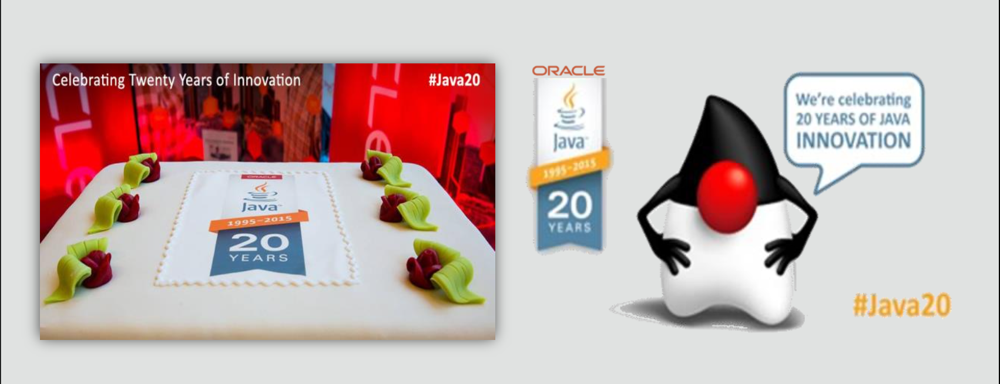
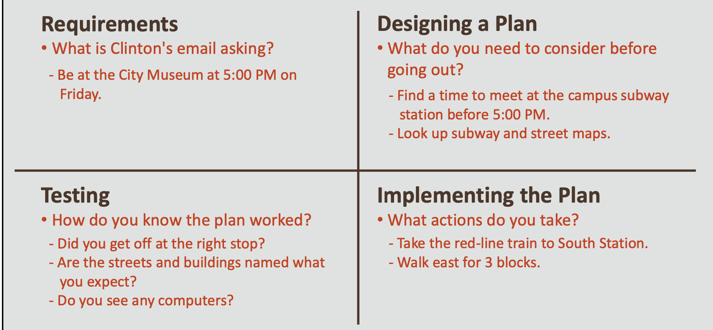
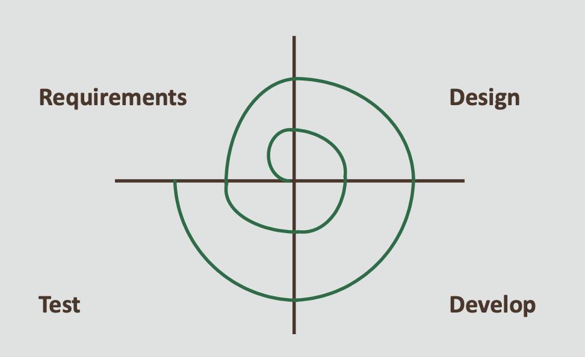
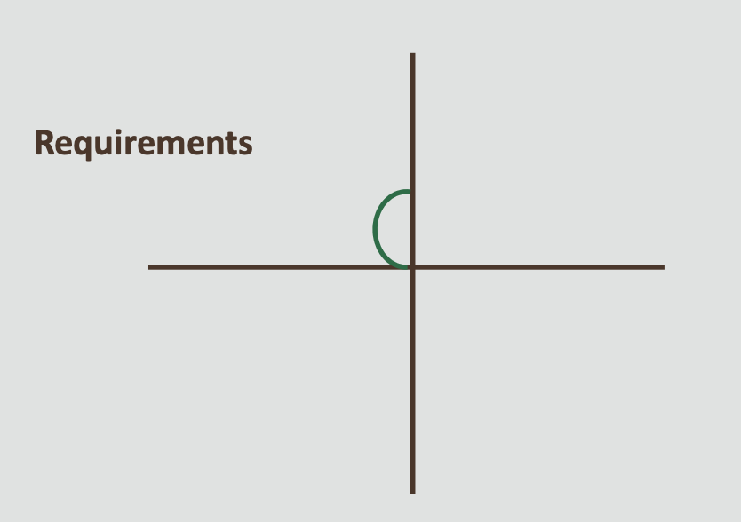
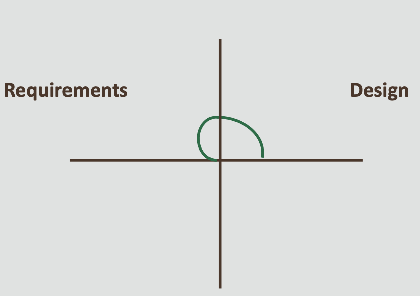
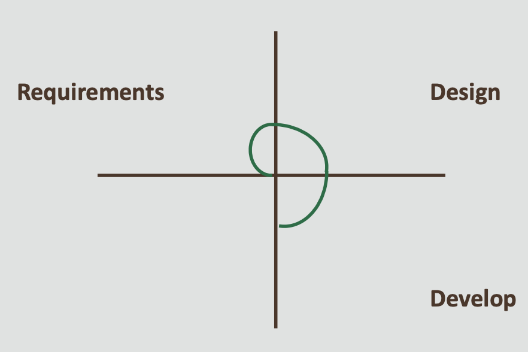
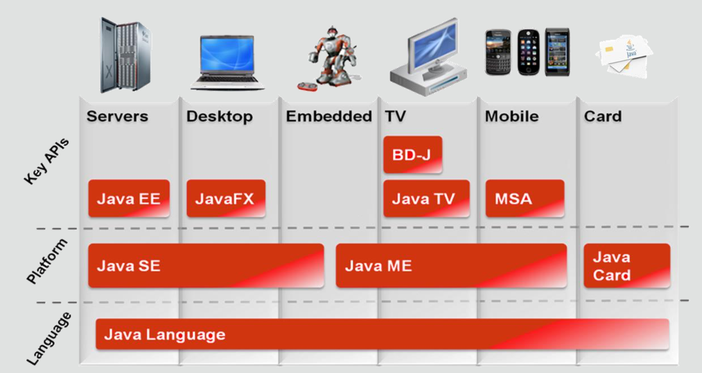

# Java Foundations 1-2 Java: A Brief History

## Objectives
### * This lesson covers the following objectives:
1. Show examples of how people interact with Java in their daily lives
2. Summarize the history of Java
3. Understand Java technology product groups

## 20 Years of Java

• 2015 marks 20 years since the first version of Java was released for public use

## Java Technology
• Java is the global standard for developing and delivering embedded and mobile applications, games, web-based content, and enterprise software

• Java enables you to efficiently develop, deploy, and use exciting applications and services

• From laptops to data centers, game consoles to scientific supercomputers, cell phones to the Internet, Java is everywhere!

## Java’s Place in the World

• Java is the single most widely used development language in the world today

• Over 9 million developers say they spend at least some of their time developing in Java, according to a recent Evans Data study

• That’s out of a world population of about 14 million developers

## Java’s Place in the World

## Java Desktops

• 1.1 billion desktops running Java (Nielsen Online, Gartner 2010)

• 930 million Java Runtime Environment (JRE) downloads per year (August 2009–2010)

• 9.5 million Java Development Kit (JDK) downloads per year (August 2009–2010)

## Java Mobile Phones

### • 3 billion mobile phones run Java

## Java TV and Card

### • 100% of Blu-ray players run Java

## Java Is Now in the Cloud!

## The Story of Java

• In 1990, Sun Microsystems began a research project to extend the power of network computing to consumer devices, such as video cassette recorders (VCRs) and televisions

• The belief was that the next wave in computing was the union of digital consumer devices and computers

• There were also frustrations with the use of the C/C++ language at Sun

**• The Green Team, a team of highly skilled software developers at Sun under the
leadership of James Gosling,
developed Java (originally called
 Oak) as their solution**
  
   - Devices with different central processing units (CPUs) could be connected and share the same software enhancements through a single programming language

• This initial concept was ahead of its time, as several deals with consumer device companies were unsuccessful

• The Green Team was forced to find another market for their new programming language

• Fortunately, the World Wide Web was becoming popular and the Green Team recognized that the Oak language was perfect for developing web multimedia components to enhance webpages.

• Initially, the Oak language was used for small applications, called applets, and programmers using the Internet adopted what eventually became the Java programming language

• The turning point for Java came in 1995, when Netscape incorporated Java into its browser
• Oracle acquired Sun Microsystems in 2010

## Duke, the Java Mascot

• Duke is Java’s official mascot

• The original Duke was created by the Green Team’s graphic artist, Joe Palrang

## Java Version History

## Java Technology Product Groups

**• There are four Java technology product groups and their target device types:**
   
   - Java Platform, Standard Edition (Java SE)
   - Java Platform, Enterprise Edition (Java EE)
   - Java Platform, Micro Edition (Java ME) 
   - Java Card
   
 
## Target Device Types

## Java SE
*  Is used to develop applications that run on desktop computers

## Java EE
*  Is used to create large enterprise, server-side, and client-side distributed applications

*Java EE is used to create large enterprise, server-side, and client-side distributed applications. For example, you can use the Java EE JDK to create a web shopping (eCommerce) application for a retail company’s website.
Java EE is built on top of the Java SE platform, extending it with additional support for large- scale, high-performance enterprise software.
Some of the kinds of functionality supported include objects, UI, integration, persistence, transactions, and security.*

## Java ME

*  Is used to create applications for devices with limited storage, display, and power capacities

*  Is used to develop applications for mobile phones, PDAs, TV set-top boxes, smart cards, Raspberry Pi, and many more

## Java Card
* **5 billion Java Cards are in use**
   - It’s used to create applications that can run securely on smart cards and similar small-memory devices
* **Java Card is typically used in the following areas (and many more):**
   - Identity
   - Security
   - Transactions 
   - Mobile phone SIMs
   
## Summary
* **In this lesson, you should have learned how to:**
  - Show examples of how people interact with Java in their daily lives
  - Summarize the history of Java
  - Understand Java technology product groups
  

