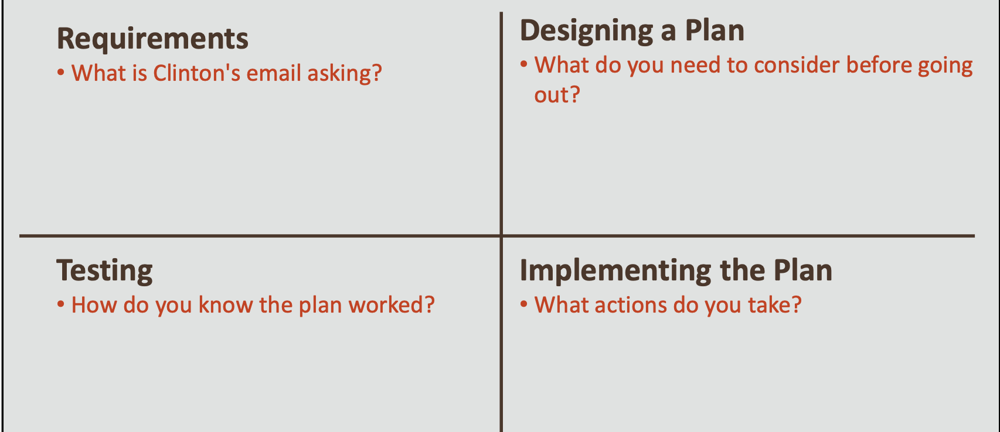
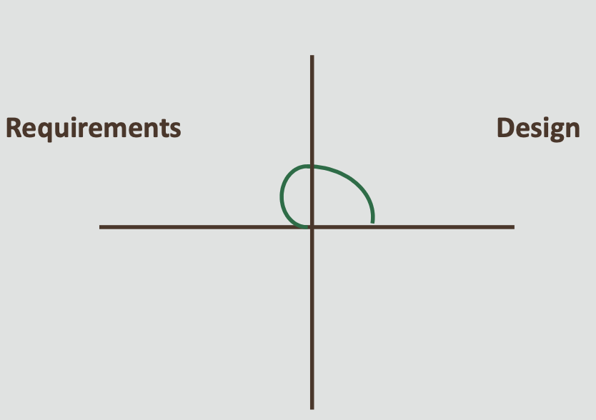
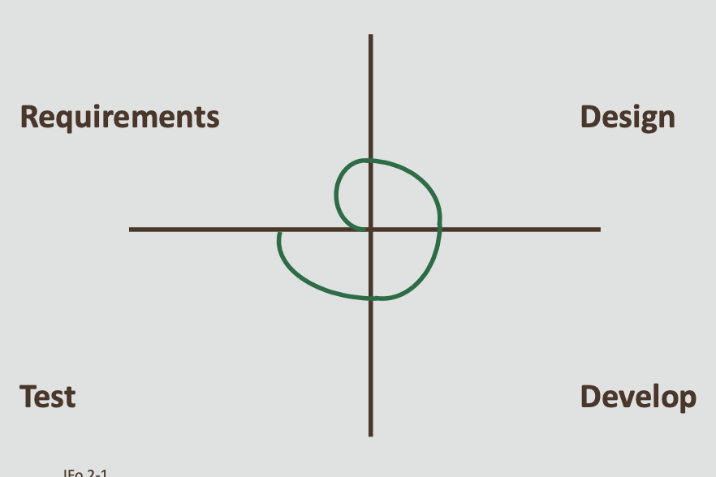
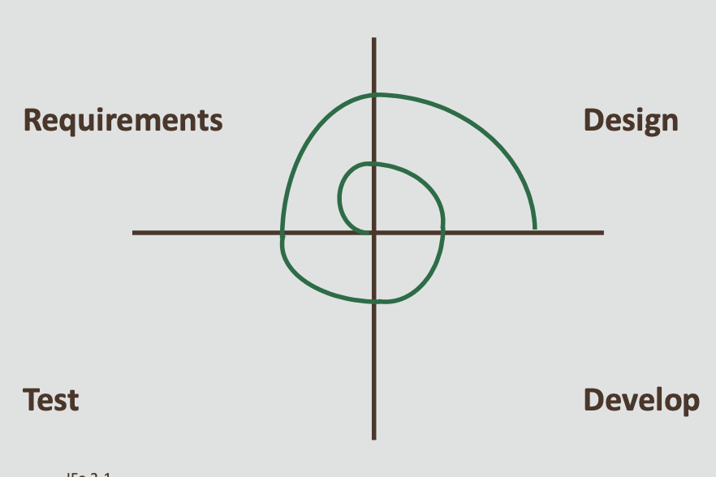

# Java Foundations 2-1 The Software Development Process

## Objectives
* **This lesson covers the following objectives:**
 - Understand the Spiral Model of development
 - Recognize tasks and subtasks of the Spiral Model 
 - Recognize what happens when steps are ignored 
 - Identify software features
 - Understand how features are gradually implemented

##  Exercise 1, Part 1
* Your buddy, Clinton, has plans for the weekend
*  Check out his email and think about what steps would be necessary to make these plans happen:

*Hey buddy,*

*There's a special Computer History exhibit at the City Museum this month. A few of us are thinking of going Friday at 5:00 PM. Would you want to join? I think the subway would be the best way to get there.*

*Clinton*

## Exercise 1, Part 2

* **Complete the chart by writing at least one item for each section**

## Friday at the Museum

* **You may have written something similar to this:**

## Introducing the Spiral Model of Development
* Developing software requires a similar thought process
* This is represented by the Spiral Model
*  There are other models, but the Spiral Model best reflects what you'll be doing in this course

## Requirements
* **Carefully read any instructions:**
 - What should your program do?
 - What problems is it trying to solve? 
 - What features must your program have?

 
## Design 
* **Plan your approach:**
 - Are there data or behaviors your program must model?
 - Will certain parts of your program need to be finished before work can begin on other parts?

 
## Develop
* **Start coding:**
  - Create a simplified version of your program
  - Focus on a small number of simple or important features

  
   
## Test 

* **Test your code:**
  - Does the program give the results that you expect? 
  - Can you find scenarios that produce unwanted results? 
  - Depending on their impact, these bugs may need fixing

## Requirements Iteration
* **Check the requirements again:**
 - Does the program's behavior match the requirements? 
 - Are there additional requirements or features to build? 
 - Should some requirements change?

## Design Iteration

* **Plan your changes:**
  - How should you model additional features?
  - Should the existing design change to better support expanding current features or adding new features?
    

## Development Iteration

* **Continue developing:**

  - Add new features 
  - Modify or enhance existing features, if necessary
    

## More Testing

* **Continue testing:**
  - Does new code work as you expect? 
  - Will old code still work properly? 
  - Depending on the severity, bugs may need fixing

## Developing, Testing, and Fixing

* **The process of developing, testing, and fixing bugs is sometimes frustrating:**
   - Code often doesn't work 
   - Unexpected bugs reveal themselves 
   - Solutions seem difficult and elusive
  
## Programming Is like Solving Puzzles

* **It may take time...**
  - Thinking
  - Experimenting
  - Researching and iterating 
 * **But it feels very rewarding to...**
   - See your code finally working (or behaving
    slightly better)
   - Watch your program evolve and become more robust
   - Find yourself becoming more skillful
   - Mischievously find ways to produce bugs
  
## How to Research

* **Are you still confused after tinkering? There are many resources to help you make progress:**
* **Lecture notes and completed small exercises**
  - Do they use commands or techniques you're looking for?
*  **Oracle's Java documentation**  

    - They outline available Java commands
    - [docs.oracle](.http://docs.oracle.com/javase/8/docs/api/index.html)
* **Internet**  
     
   - Other people may have asked questions similar to yours.
   - You may uncover helpful examples or promising new commands
   - But your solutions should be your own, not copied code
  
## Exercise 2, Part 1
* **Here is Clinton's email again, in case you need it for this exercise**

*Hey buddy,*
   
*There's a special Computer History exhibit at the City Museum this month. A few of us are thinking of going Friday at 5:00 PM. Would you want to join? I think the subway would be the best way to get there.*

*Clinton*

## Exercise 2, Part 2
* **Complete this chart**
   - Imagine what might happen to your night at the museum if a particular step were forgotten:

  

## Forgotten Friday
 * **You may have written something similar to this:**

## Forgetting Steps in the Spiral Model
* **Similarly, bad things can happen when a particular step of the Spiral Model is forgotten**

## What Is a Software Feature?

* **Think of a feature as:**
  - Something that a program can do
  - Something that you can do with a program
* **Examples:**  
     
  - Printing text
  - Playing a sound
  - Calculating a value
  - Dragging and dropping an icon
  - Posting a high score to an online leaderboard
  - A new type of enemy in a video game
  
## Implementing a Feature

* **Some features are easier to implement:**
    
  - You can code them in a few simple lines
  - For example, printing text to NetBean's output window
* **Some features are difficult to implement**  
  
  - They rely on a combination of other features
  - For example, being able to "drag and drop" an icon

## Implementing "Drag and Drop"
* **A "drag and drop" feature requires several smaller features:**
  
  - Adding a graphic to the screen
  - Finding the mouse position
  - Detecting a mouse click
  - Detecting a mouse release
  - Changing the position of the graphic
  
* **Implementing just one of these items can feel like a big accomplishment**

## Case Study: Java Puzzle Ball
* This game is written entirely in Java FX
* It's designed to teach programming concepts
* We've saved all the old versions of this game so that you can explore how features were gradually implemented!

## The Game's Development Process
* **These are the steps we tried to take:**
  
  - Brainstorm and prototype game ideas
  - Document goals and requirements for the best idea 
  - Break requirements into tasks/features and add them to a schedule 
  - Develop 
  - Test 
  - Iterate and reevaluate requirements
  
## Exercise 3, Part 1
* Download, unzip, and play these versions of the game:
* August 16, 2013  (08-16-13.jar)
* August 22, 2013  (08-22-13.jar)
* September 27, 2013 (09-27-13.jar)
* October 16, 2013  (10-16-13.jar)
* November 21, 2013 (11-21-13.jar)

## Exercise 3, Part 2
* **Spend a couple minutes exploring each version**
* **Note any new features, bugs, or changes between versions**
* **Don't worry about beating levels**

  - Levels (if they even exist) aren't ordered correctly by difficulty
  - A lot of helpful tutorial features are missing
  
## August 16, 2013

* **Did you have fun?**
  
  - Probably not
  - This version isn't a game yet
  
* **Goals of this version:**

  - Have the developer learn Java FX
  - Implement a few basic features

* **Notable features:**  
  
  - Display images on screen
  - Detect mouse events
  - Rotate BlueBumpers
  - Drag and drop an icon into slots (N, E)
  
## August 22, 2013
* **One week later:**
  
  - This version still isn't a game
  - But it's looking more impressive
* **Notable features:**  

  - User Interface (UI) wheels and icons positioned on the right
  - A RedBumper
  - Colorized attachments
  - More icons to drag and drop
  
## September 27, 2013
* **About one month later:**

  - This version could be called a game
  - The goal is to deflect the ball to Duke
  
* **You'll notice a couple files after unzipping:**

  - The new folder holds code responsible for ball movement
  - A different developer created the code
  
_Wheels snap every 45 degrees because the code responsible for ball movement wasn't designed to calculate only eight possible collision/angle scenarios._

## September 27, 2013
* **Notable features:**

  - A Play button and a goal (Duke)
  - A ball that can move and be deflected
  - More shapes that can be attached
  - Yellow lines (for collision detection)
  - Wheels that snap to the nearest 45-degree increment
  
_Wheels snap every 45 degrees because the code responsible for ball movement wasn't designed to calculate only eight possible collision/angle scenarios._

## October 16, 2013
* **A few weeks later, we created additional game modes (Inheritance & Geometry Test)**
* **There is a pop-up for choosing levels**
   
  - Because we didn't know how to unload/swap between levels
  - You have to close the program to load a different level
  - Levels are for testing features, and aren't quite puzzles for players
  
## October 16, 2013
* **More notable features:**
  
  - Level geometry
  - A GreenBumper and GreenWheel
  - Level-building instructions are read from a text file (but you couldn't have known that)
  
## November 21, 2013
* **Over one month later:**

  - We figured out how to unload levels!
  - Only a single file is necessary to run the game
  
* **Use the Options button to choose levels**

  - It's a temporary solution until we learned to create menus
  - Levels are actual puzzles instead of tech demos
  
## November 21, 2013
* **More notable features:**

 - Fancy new background art
 - More levels
 - Slots are labeled ABCD instead of NESW (People thought their solutions were wrong if the N slot didn’t face north)

## The Current Version
* Development continued several more months into 2014
* You'll notice new features and changes in the latest version
* We'll revisit Java Puzzle Ball later in this course

_There were features that never made it into the game, either because we didn't have time or we thought they would be a bad idea; for example, puzzles with more than one ball (super difficult multi-threading puzzles). There are also a few bugs with the current version.
We'll encounter Java Puzzle Ball next in Lesson 3 of this section._

## Spiral Model Summary

## Summary
* **In this lesson, you should have learned how to:**

  - Understand the Spiral Model of development
  - Recognize tasks and subtasks of the Spiral Model
  - Recognize what happens when steps are ignored
  - Identify software features
  - Understand how features are gradually implemented
  
    
  
 
