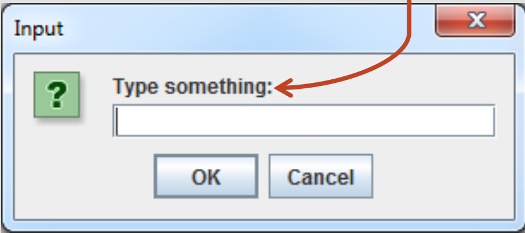

#  Java Foundations 4-1 What Is a Method?

## Objectives
* **This lesson covers the following objectives:**

   - Structure code within a class
   - Instantiate an object
   - Understand the benefits of methods
   - Use the dot operator (.) to access an object’s fields and methods
   - Supply arguments to a method −Return values from a method
    
## Classes You’ll Encounter
* In Java development, you’ll encounter many classes for many different object types, including ...
* Classes you’ll write yourself
* Classes written by someone else
* Classes belonging to Java

## Classes You’ll Encounter
* **These classes outline objects’ ...**

   - Properties (fields)
   - Behaviors (methods)
    
    
* **The goal of this lesson is to give you an understanding of how to work with any class, its fields, and its methods**
* **The remaining lessons of this section explore important classes provided by Java**
* **We’ll start by exploring classes and methods a little deeper**

## Exercise 1, Part 1
* **Let’s look at a scenario and see how we can model the components involved:**

   - It’s Alex’s birthday! You’ve arranged a group of eight friends to celebrate at a local restaurant. When your party receives their bill, nobody is quite sure what they owe. You only know everyone’s total before tax (5%) and tip (15%). But lucky you! You brought your laptop and are asked to write a program that calculates everybody’s total
    
_Your friends know you’re taking the Java Foundations course, so you’re the perfect person to figure this out!_

## Exercise 1, Part 2
* **Import and edit the Tip01 project**
* **This is what everyone owes before tax (5%) and tip (15%):**

## Exercise 1, Part 3
* **Your program should produce the following output:**

## Modeling Objects
* **You may have been tempted to model each person’s total by writing this:**

`public class Tip01{`

`public static void main(String args[]){`

`double person1 = 10;`

`double total1  = person1*(1 +.05 +.15);`

`System.out.println(total1);
}//end method main`

`} //end class Tip01`

## Modeling More Objects
* **When you needed to model two dinner guests, you may have been tempted to copy, paste, and rename:**

`public class Tip01{`

`public static void main(String args[]){`

`double person1 = 10;`

`double total1  = person1*(1 +.05 +.15);`

`System.out.println(total1);`

`double person2 = 12;`

`double total2  = person2*(1 +.05 +.15);`

`System.out.println(total2);
}//end method main`

`}//end class Tip01`

## Modeling Many Objects
* **What if you needed to figure 1,000 guests?**
   
   - //You might think ... 
   - //Do I really have to copy, paste, and rename 1,000 times?
 
   
* **What if one of your friends forgets their wallet? What if you made a mistake with your formula?**

   - //You might think ... 
   - //Do I need to make 1,000 edits?! 
   - //There has to be a better way!!!
    
## Variables Offer Flexibility
* **If the tax rate or tip percentage needs to change ...**
* **We don’t need to make 1,000 edits**
* **We simply edit each variable once**

[comment]: <> (`double tax = 0.05;` )

[comment]: <> (`double tip = 0.15;`)

[comment]: <> (`double person1 = 10;`)

[comment]: <> (`double total1  = person1*&#40;1 +tax +tip&#41;;`)

[comment]: <> (`System.out.println&#40;total1&#41;;`)

[comment]: <> (`double person2 = 12;`)

[comment]: <> (`double total2  = person2*&#40;1 +tax +tip&#41;;`)

[comment]: <> (`System.out.println&#40;total2&#41;;`)

#Methods Offer Similar Flexibility

* **The same math and printing behaviors are repeated**
* **Instead, this logic can be written once in a method**

`double tax = 0.05;`

`double tip = 0.15;`

`double person1 = 10;`

`double person2 = 12;`

`double total1  = person1*(1 +tax +tip);`

`System.out.println(total1);`

`double total2  = person2*(1 +tax +tip);`

`System.out.println(total2);`

#When to Use Methods
*  It’s a good idea to write a method if you ...
*  Find yourself repeating very similar lines of code, including calculations
*  Need to describe an object’s behavior