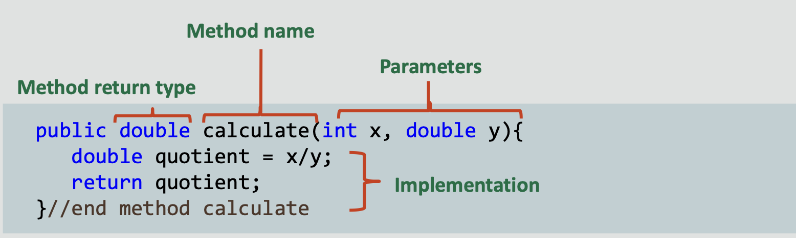

#  Java Foundations 4-1 What Is a Method?

## Objectives
* **This lesson covers the following objectives:**

   - Structure code within a class
   - Instantiate an object
   - Understand the benefits of methods
   - Use the dot operator (.) to access an object’s fields and methods
   - Supply arguments to a method −Return values from a method
    
## Classes You’ll Encounter
* In Java development, you’ll encounter many classes for many different object types, including ...
* Classes you’ll write yourself
* Classes written by someone else
* Classes belonging to Java

## Classes You’ll Encounter
* **These classes outline objects’ ...**

   - Properties (fields)
   - Behaviors (methods)
    
    
* **The goal of this lesson is to give you an understanding of how to work with any class, its fields, and its methods**
* **The remaining lessons of this section explore important classes provided by Java**
* **We’ll start by exploring classes and methods a little deeper**

## Exercise 1, Part 1
* **Let’s look at a scenario and see how we can model the components involved:**

   - It’s Alex’s birthday! You’ve arranged a group of eight friends to celebrate at a local restaurant. When your party receives their bill, nobody is quite sure what they owe. You only know everyone’s total before tax (5%) and tip (15%). But lucky you! You brought your laptop and are asked to write a program that calculates everybody’s total
    
_Your friends know you’re taking the Java Foundations course, so you’re the perfect person to figure this out!_

## Exercise 1, Part 2
* **Import and edit the Tip01 project**
* **This is what everyone owes before tax (5%) and tip (15%):**


## Exercise 1, Part 3
* **Your program should produce the following output:**


## Modeling Objects
* **You may have been tempted to model each person’s total by writing this:**

<<<<<<< HEAD:Section 4/Java Foundations 4-1 What Is a Method?.md
```public class Tip01{
  public static void main(String args[]){
  double person1 = 10;
  double total1  = person1*(1 +.05 +.15);
  System.out.println(total1);
=======
```
public class Tip01{
   public static void main(String args[]){
   
   double person1 = 10;
   double total1  = person1*(1 +.05 +.15);
   System.out.println(total1);
>>>>>>> de1ad23 (4-1 done):Section 4/ Java Foundations 4-1 What Is a Method?.md
}//end method main
} //end class Tip01
```

## Modeling More Objects
* **When you needed to model two dinner guests, you may have been tempted to copy, paste, and rename:**

```
public class Tip01{
  public static void main(String args[]){
  double person1 = 10;
  double total1  = person1*(1 +.05 +.15);
  System.out.println(total1);
  double person2 = 12;
  double total2  = person2*(1 +.05 +.15);
  System.out.println(total2);
}//end method main

}//end class Tip01
```

## Modeling Many Objects
* **What if you needed to figure 1,000 guests?**
   ```
   //You might think ... 
  //Do I really have to copy, paste, and rename 1,000 times?
  ```
 
   
* **What if one of your friends forgets their wallet? What if you made a mistake with your formula?**
```
    //You might think ... 
    //Do I need to make 1,000 edits?! 
    //There has to be a better way!!!
   
   ```
    
## Variables Offer Flexibility
* **If the tax rate or tip percentage needs to change ...**
* **We don’t need to make 1,000 edits**
* **We simply edit each variable once**
```
double tax = 0.05;
double tip = 0.15;
double person1 = 10;
double total1  = person1*(1 +tax +tip);

System.out.println(total1);

double person2 = 12;
double total2  = person2*(1 +tax +tip);

System.out.println(total2);
```


## Methods Offer Similar Flexibility

* **The same math and printing behaviors are repeated**
* **Instead, this logic can be written once in a method**
```
double tax = 0.05;
double tip = 0.15;
double person1 = 10;
double person2 = 12;

double total1  = person1*(1 +tax +tip);

System.out.println(total1);

double total2  = person2*(1 +tax +tip);

System.out.println(total2);
```


## When to Use Methods
*  It’s a good idea to write a method if you ...
*  Find yourself repeating very similar lines of code, including calculations
*  Need to describe an object’s behavior

## How to Use a Main Method
* **The main method is known as a driver**

  - Use it to drive the events of a program
  - Use it to access fields and methods or other classes
  
  
* **The main method doesn’t describe the behavior of any particular object**

  - Keep it separate from your object classes
  - Use only one main method for each application
  
## What Do Object Classes Look Like?
* Code should fit the following format
* Let’s see how we can get our code to look like this:


## Step 1) Move Fields from the Main Method
```
public class Calculator{

//Fields 
public double tax = 0.05;  
public double tip = 0.15;
public double originalPrice = 10;

public static void main(String args[]){ 
//double tax = 0.05;
//double tip = 0.15;
         
//double person1 = 10;
double total1 = person1*(1 + tax + tip);
System.out.println(total1);
 }//end method main
}//end class Calculator
 ```

## Step 2) Move Repeated Behaviors from the Main Method
```
public class Calculator{ //Fields
      public double tax = 0.05;
      public double tip = 0.15;
      public double originalPrice = 10;

      //Methods
      public void findTotal(){ 
      //Calculate total after tax and tip
      //Print this value 
      }//end method findTotal

       public static void main(String args[]){
         //double total1 = person1*(1 + tax + tip);
         //System.out.println(total1);
         
} //end method main } 
//end class Calculator
```

## Step 3) Remove the Main Method
```
public class Calculator{ 
     //Fields
      public double tax = 0.05;
      public double tip = 0.15;
      public double originalPrice = 10;
      
      //Methods
      public void findTotal(){ 
      //Calculate total after tax and tip
      //Print this value }
      //end method findTotal

//public static void main(String args[]){
     //double total1 = person1*(1 + tax + tip);
     //System.out.println(total1);
//}//end method main

} //end class Calculator
```
##Success!
```
public class Calculator{ 
       //Fields
       public double tax = 0.05;
       public double tip = 0.15;
       public double originalPrice = 10;
       
      //Methods
      public void findTotal(){ 
      //Calculate total after tax and tip
      //Print this value 
      }//end method findTotal
      
} //end class Calculator
```
## Where Do I Put the Main Method?
```
public class CalculatorTest {
       public static void main(String args[]){
          //Create Calculator object instance
          Calculator calc = new Calculator();
          
          calc.tip = 0.10; //Altering a field
          calc.findTotal(); //Calling a method
          
 }//end method main
}//end class CalculatorTest

```
* **Put the main method in another class, such as a test class**
* **The main method drives the action of the program:**

  - It creates instances of objects
  - It calls an instance’s fields and methods by using the dot operator (.)
## Variables for Objects


* **Objects, like primitives, are represented by variables**
* **Most objects require the new keyword when they’re initialized to create new instances**

  - This is called instantiating an object
  - There are some exceptions, like String objects, that don’t
    require the new keyword
    
## Using the Dot Operator
* **Place the dot operator (.) after a variable’s name to access its fields or methods**
```
public class CalculatorTest {
       public static void main(String args[]){
        Calculator calc = new Calculator();
        
        calc.printTip(); //prints 0.15 
        calc.tip = 0.10;
        calc.printTip(); //prints 0.10
        
 }//end method main 
}//end class CalculatorTest
```

```
 public class Calculator{
       public double tip = 0.15;  //initialized value 0.15
       
       public void printTip(){
          System.out.println(tip);
          
    }//end method printTip 
}//end class Calculator
```

## Exercise 2, Part 1
* **Import and open the *Tip02* project**
* **Complete the findTotal() method, which should:**

  - Calculate a total based on the tax, tip, and originalPrice fields 
  - Print a person’s total
  
## Exercise 2, Part 2
* **From the main method:**

  - Instantiate a Calculator object named calc
  - Observe NetBeans after typing "calc"
  - Access this object’s fields and methods to print the total for each person at the birthday party
* **Change tip and tax if you prefer different values**

## What You May Have Written
* **You may have written your program like this:**

  - Two lines are required for each person
  - And more if you decide to print names or change tax/tip values
  
```
public class CalculatorTest{
   public static void main(String args[]){
       Calculator calc = new Calculator();
       
       calc.originalPrice = 10;
       calc.findTotal();
       
       calc.originalPrice = 12; 
       calc.findTotal(); 
       
       }//end method main
}//end class CalculatorTest
```
## Becoming More Flexible
* **But it’s possible to do the same work in a single line**
* **It’s also dangerous to write programs that access fields directly**

  - You’ll learn about this later
  - The goal of this lesson is just to prepare you to work with
    important Java-provided classes
    
```
       calc.originalPrice = 10; //Dangerous 
       calc.findTotal();
```
## Remember the JOptionPane
* When we add the String literal "type something:" to the method call, we’re supplying arguments to the method
* This argument alters the resulting JOptionPane
```
JOptionPane.showInputDialog("Type something:");
```


## When Can Methods Accept Arguments?
* **You’ll find that many methods are affected by arguments**

  - But methods must be written in a way to accept arguments 
  - Otherwise, the compiler complains
  - The calculate method is written to accept no arguments
  
```
 Calculator calc = new Calculator(); 
 calc.calculate(); //Good 
 calc.calculate(3, 2.0); //Fail
```
```
public void calculate(){ 
    //How do I calculate?
}//end method calculate
```

## Method Argument Animation
* **But this calculate method is written to accept two arguments:**

  - The first argument must be an int
  - The second argument must be a double
  
```
   Calculator calc = new Calculator();
   calc.calculate(3, 2.0);
```
```
   public void calculate(int x, double y){ 
     System.out.println(x/y);      //prints 1.5
}//end method calculate
```
* **The variable int x is assigned a value of 3**
* **The variable double y is assigned a value of 2.0**

## Argument Order Matters
* **What happens if we reverse the order of our arguments?**
```
  Calculator calc = new Calculator();
  calc.calculate(2.0, 3);
```
* **We get a compiler error:**

  - int x cannot be assigned a double value 
  - The first argument must be an int
  
```
   public void calculate(int x, double y){
      System.out.println(x/y);
}//end method calculate
```

## Exercise 3, Part 1
* **Import and open the Tip03 project**
* **From the main method:**

  - Use a Calculator object instance and supply arguments to
    findTotal() to print the total for each person
  - **Hint:** Observe the findTotal() method in the Calculator class to figure out how many arguments this method accepts
## Exercise 3, Part 2
* Who does each total belong to?
* Modify the findTotal() method to accept an additional String name argument
* Concatenate the print statement to include name
* Observe NetBeans’ complaint in the main method and
revise your findTotal() method calls
  
## Method Arguments and Parameters
* **An argument is a value that’s passed during a method call:**
  

  

* **A parameter is a variable that’s defined in the method declaration:**


_**Note:** When it’s called, a value that’s passed into the method is called an **argument**, whereas a variable that’s defined in the method declaration is called a **method parameter.**
In this example, 3 and 2.0 are arguments passed to be the values of x and y within the calculate method._

## Method Parameters: Examples
* **Methods may have any number or type of parameters:**

```aidl
   public void calculate0(){
     System.out.println("No parameters");
}//end method calculate0
```
```
    public void calculate1(int x){ 
       System.out.println(x/2.0);
}//end method calculate1
```
```
    public void calculate2(int x, double y){ 
        System.out.println(x/y);
}//end method calculate2
```
```
    public void calculate3(int x, double y, int z){ 
        System.out.println(x/y +z);
}//end method calculate3
```
_Methods can take any number of parameters and use these values within the method code block._

## The Scope of Parameters
* **Methods need to be told what to do with the arguments they receive**
* **You do that by using method parameters**

  - Method parameters are variables that exist within the entire
    scope of a method
  - They’re created within the method declaration 
  - Scope refers to the {block of code} belonging to a method following its declaration
```
    public void calculate(int x, double y){
       System.out.println(x/y);
}//end method calculate
```

## Referencing Method Parameters
* **A variable may be referenced anywhere within its current block after being declared**
* **A variable can’t be referenced outside the block where it was declared or before being declared**

**Scope x**
```
    public void calculate(int x, double y){ 
        System.out.println(x/y); //Scope x
} //end method calculate
```
**Not in Scope x**
```
    public void calculate2(){  //Not in Scope x
        System.out.println(2*x); //What is x?
} //end method calculate2
```

[comment]: <> (## Finding the Grand Total: Scenario)

[comment]: <> (* **Your friends are impressed with how much you’re learning from the Java Foundations course! Alex asks, “What should the entire table’s total be?” Knowing the answer to this question would help make sure everyone has contributed and that the server has received the correct amount**)

[comment]: <> (* **How can this be included in your code?**)

## Adding Totals
* **Another way to think about this:**
 
  - I’ve calculated a value within a method ...
  - But it’s stored as a variable that can’t exist outside the scope of its method block ...
  - How do I get this value out of there?
  
```
    public void findTotal(double price, String name){
      double total = price * (1 + tax + tip);
      System.out.println(name + ": $ " + total);
} //end method findTotal
```
## Adding Totals


## Adding Totals
* **If you thought about writing your program like this:**
```
   public class CalculatorTest{
   public static void main(String args[]){
       Calculator calc = new Calculator();
       calc.findTotal(10);
       calc.findTotal(12);
       System.out.println(calc.findTotal(10) +
       calc.findTotal(12));
}//end method main }//end class CalculatorTest
```
* **You’re half correct**
* **But NetBeans gives you the following error:**
    
  - 'void' type not allowed here
  
## What Is a Void Type?
* **showInputDialog() is a String type method**
 
  - It returns a value that can be stored as a String
  ```
    String input = JOptionPane.showInputDialog("Type something:");
  ```
  
* **Void type methods don’t return any values**

  - There are no values to store after a void method is called
  ```
    System.out.println("println is a void type method");
  ```
## Method Return Types
* **Variables can have values of many different types:**

  - int
  - double
  - short
  - long
  - boolean
  - char
  - float
  - byte
  - _String_
  - _Calculator_ 
  
* **Method calls also return values of many different types:**

  - int
  - double
  - short
  - long
  - boolean
  - char
  - float
  - byte
  - _String_
  - _Calculator_ 
  
* **How to make a method return a value:**

  - Declare the method to be a nonvoid return type
  - Use the keyword return within a method, followed by a value
  
## Method Return Types: Examples
* **Methods must return data that matches their return type:**
```
    public void printString(){
     System.out.println("Hello");
}//end method printString
```
```
    public String returnString(){
     return("Hello");
}//end method returnString
```
```
   public int sum(int x, int y){
    return(x + y);
}//end method sum
```
```
    public boolean isGreater(int x, int y){
     return(x > y);
}//end method isGreater
```

_Void methods don’t need a return statement. Void methods are incapable of returning a value in Java, although they can have a return statement. The type of value that a method returns must match the declared return type. For example, a boolean type method must return a boolean. A String type method must return a String._

## Method Return
* **The following code examples produce equivalent results:**
```
    public static void main(String[] args){ 
      int num1 = 1, num2 = 2;
      int result = num1 + num2; 
      System.out.println(result);
}//end method main
```
```
   public static void main(String[] args){ 
     int num1 = 1, num2 = 2;
     int result = sum(num1, num2); 
     System.out.println(result);
}//end method main
   public static int sum(int x, int y){
     return(x + y); 
}//end method sum
```
_In the top example, num1 and num2 are added together. In the bottom example, this logic is put into the sum method. Values are passed to the sum method and added. The resulting integer value is passed back and assigned to the result variable. For now, ignore the static keyword in the sum method._

## Passing Arguments and Returning Values


## Exercise 4, Part 1
* **Edit your Tip03 solution**

  - Or import the Tip04 project
  
* **Find and print the entire table’s total, including tax and tip**

  - Find and print the entire table’s total, including tax and tip
  
_It’s also possible to find the total by creating a field within the Calculator class and adding to it each time you call findTotal(). However, it isn’t always (but sometimes is) desirable to store a calculated value as a field. This field could also be tampered with. The total could be incorrect if someone wants to refresh their memory and check their individual total again. And if we chose that solution, we wouldn’t have any reason to show you how cool it is for methods to return values!_

## Exercise 4, Part 2
* Person8 forgot their wallet
* And Alex’s meal was meant to be a birthday present
* Modify findTotal() so that the cost of their meals are shared equally with the rest of the party
* Recalculate the entire table’s total
* This number shouldn’t have changed

## Summary About Method Syntax


## Summary
* **In this lesson, you should have learned how to:**

  - Structure code within a class
  - Instantiate an object
  - Understand the benefits of methods
  - Use the dot operator to access an object’s fields and methods −Supply arguments to a method
  - Return values from a method


<<<<<<< HEAD:Section 4/Java Foundations 4-1 What Is a Method?.md
#When to Use Methods
*  It’s a good idea to write a method if you ...
*  Find yourself repeating very similar lines of code, including calculations
*  Need to describe an object’s behavior
=======
>>>>>>> de1ad23 (4-1 done):Section 4/ Java Foundations 4-1 What Is a Method?.md
