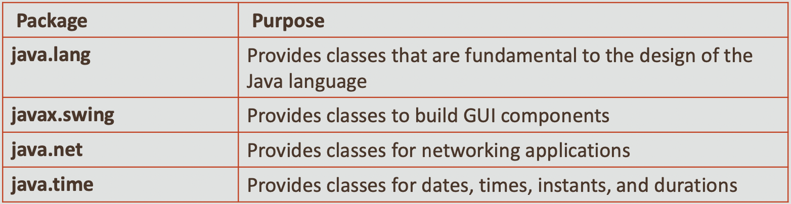
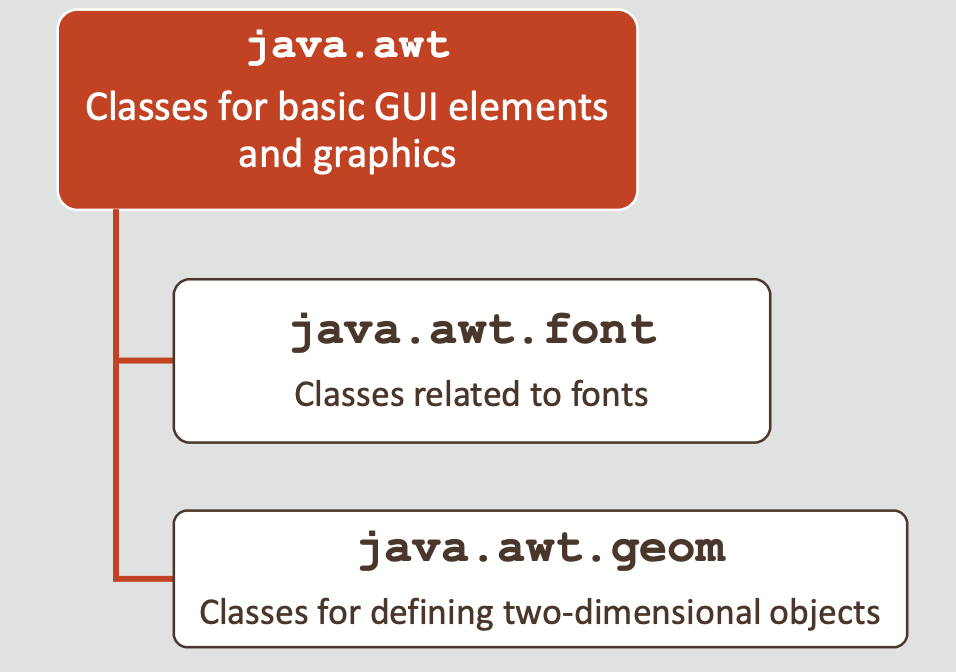
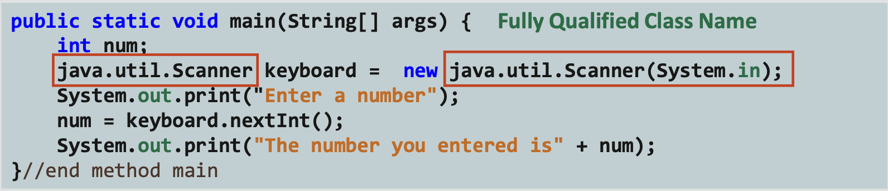
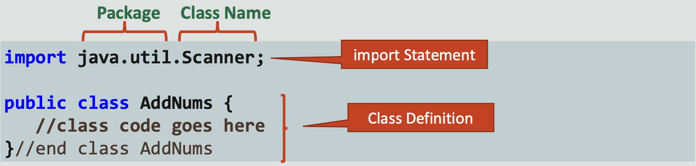
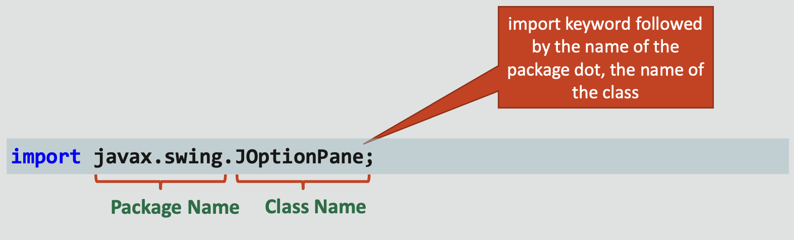
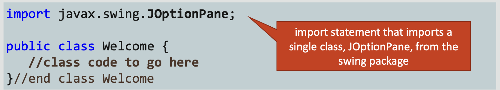
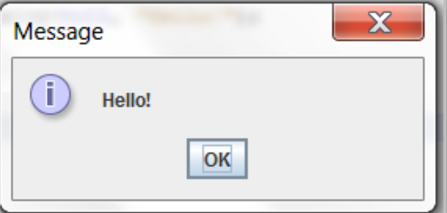
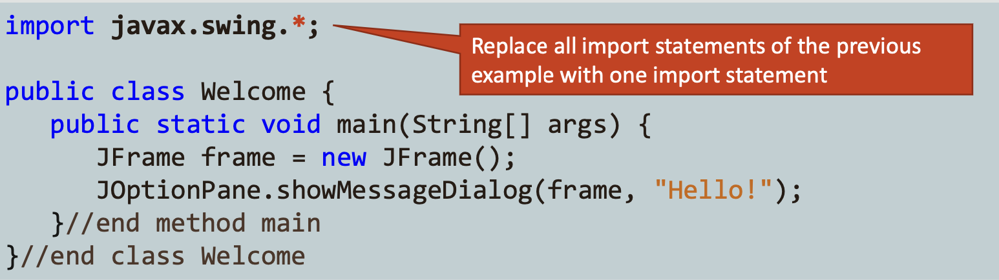
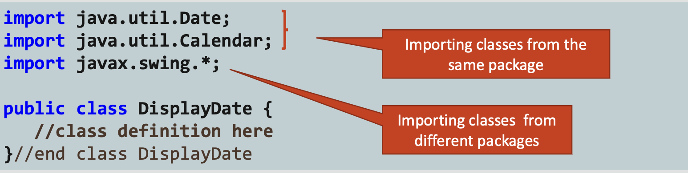

# Java Foundations 4-2 The import Declaration and Packages

## Objectives
* **This lesson covers the following objectives:**

    - Access a class by using its fully qualified name
    - Describe the function of the import statement
    - Use the import statement to access a class in a package 
    - Understand the purpose of an asterisk in an import statement 
    - Identify packages that are automatically imported
    
## Why Should You Reinvent the Wheel?
* **Frequently, you may rewrite the same Java code for different programs**
* **As an alternative to rewriting the same code, you can use the Java-provided library, which organizes frequently used code**
* **This library is called as Java class library**
* **The Java class library documentation is available here:**

    - [Java class library documentation]( https://docs.oracle.com/javase/8/docs/api/)

## Packages in the Java Class Library
* **The classes of the Java class library are organized into packages**
* **A package contains a group of related classes**
* **With a package, it becomes easier to locate the related
  classes**
  
## Packages in the Java Class Library



## How Are the Packages Organized?
* **The vast collection of classes are organized into a tree- like hierarchy, which allows packages to be divided into subpackages, like this:**
  


## Using a Class from a Package
* **To use a class from a package in your program, you need to specify its fully qualified name**
* **For example, to use the Scanner class to read a keyboard input, the fully qualified name for the Scanner class, which is defined in the java.util package, is:**


## Using the Fully Qualified Class Name
* **As you can see, using the fully qualified name creates very long names for classes**
* **Long names reduce the readability of the code and also make coding difficult**



## Is There an Alternative to the Fully Qualified Name?
* **Suppose that you have a friend whose name is Santi Inez Luis Vidal**

    - How tedious is it to call him by his full name every time? 
    - If you could simply refer to him as “Santi,” it would be so
      much more convenient
      
* **Similarly, accessing Java classes by using fully qualified names is equally tedious in your programs**
* **Let’s see if there’s a way to specify only the name of the class instead of its fully qualified name**

## Using the import Statement
* **You can avoid the fully qualified class name by using the import statement**
* **You place the import statement above your class definition. It looks like this:**

    - _import package.className_
    - Example:



## How Do You Import a Single Class?
* **You can import a single class or an entire package**
* **To import a single class into your program, you write an import statement like this:**



## javax.swing Package
* **Java has an extensive library for constructing GUIs**
* **This library, called swing, can be imported into your program to give you access to Java’s GUI functionality**
* **The swing library is in the javax.swing package**

## Accessing a Class from the swing Package
* **The swing package has a JOptionPane class**
* **This class creates a pop-up window that can be used to display strings of text to the user**
* **To use the JOptionPane class, you must first import it into your class:**



## Importing the JOptionPane Class
* **You can then use JOptionPane to display text by calling the showMessageDialog method inside the JOptionPane class**
```
import javax.swing.JOptionPane; 
public class Welcome {
    public static void main(String[] args) { 
       JOptionPane.showMessageDialog(null, "Hello!");
  }//end method main
}//end class Welcome
```
## Output Looks Like This!



## How Do You Import All Classes in a Package?
* **You can import all classes in a particular package by
  using the * wildcard character in the import statement**
  
## How Do You Import All Classes in a Package?
* **Let’s say you want to extend the previous example by creating an instance of the Jframe class and add its reference to JOptionPane, like this:**
```
import javax.swing.JOptionPane; 
import javax.swing.JFrame; /*Importing 2 classes 
                             from the swing package */
public class Welcome {
   public static void main(String[] args) {
      JFrame frame = new JFrame(); 
      JOptionPane.showMessageDialog(frame, "Hello!");
   }//end method main
}//end class Welcome
```
## Accessing All Classes from the swing Package
* **As you access more classes from the swing package in your program, the number of import statements also increases**

## Accessing All Classes from the swing Package

* **To avoid this, you can import all classes from the swing package by using the * wildcard character in the import statement, like this:**



## Including Multiple import Statements
* **You can include multiple import statements in a Java program to access classes in the same package or in different packages**
* **For example:**



## Identify Packages That Are Automatically Imported
* **So far, you have used System.out.println() to print text to the console**
```
public class DisplayOutput {
   public static void main(String[] args) { 
      System.out.println("Hello, how are you today?");
    }//end method main
}//end class DisplayOutput
```
* **However, you didn’t import a package for using this method in your program**
* **So how does Java know what to do when you call it?**

## java.lang Package
* **If you look at the Java library, you’ll see that the System class is organized in the java.lang package**
* **By default, the java.lang package is automatically imported into all Java programs**

## Exercise 1
* **Import and open the** *ImportEx* **project**
* **Examine** *AddImport.java*

    - Perform the following:
    - Replace the fully qualified name to access the Jlabel component with an import statement
    - To import classes from the util package, replace multiple import statements with a single import statement
    
## Summary
* **In this lesson, you should have learned how to:**

    - Access a class by using its fully qualified name
    - Describe the function of the import statement
    - Use the import statement to access a class in a package 
    - Understand the purpose of an asterisk in an import statement −Identify packages that are automatically imported

