# Java Foundations 4-3 The String Class
## Objectives
* **This lesson covers the following objectives:** 

  - Locate the String class in the Java API documentation 
  - Understand the methods of the String class 
  - Compare two String objects lexicographically
  - Find the location of a substring in a String object 
  - Extract a substring from a String object
  
## What’s a String?
* **For example:**
	
	- “How are you?” is a string that contains letters, white space,
and a special character (‘?’)
* **In Java, strings are not a primitive data type** 
* **Instead, they are objects of the String class**

## Representing Strings in Java
* **In Java, strings are objects of the class named java.lang.String**
* **Example:**

	- String s1= “Hello, World”;
	
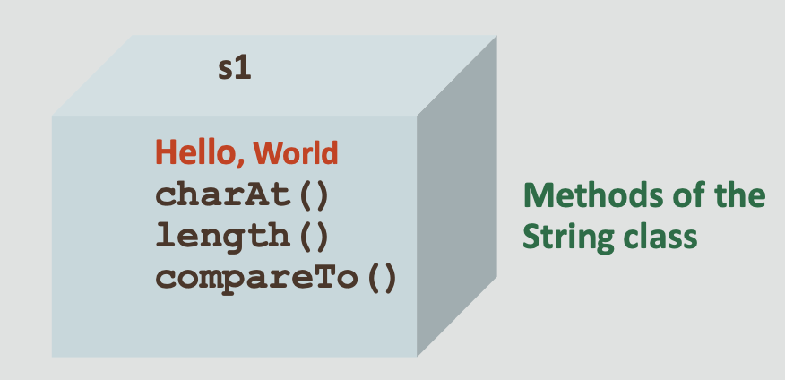

## Representing Strings in Java
* **A string in Java is more abstract**
* **That is, you aren’t supposed to know about its internal structure, which makes it easy to use**
*  **Its methods allow a programmer to perform operations on it**

## Using the String Class
* **The String class:**

	 - Is one of the many classes included in the Java class libraries.
	 - Is part of java.lang.package
	 - Provides you with the ability to hold a sequence of characters of data
* **You will use the String class frequently throughout your programs**
* **Therefore, it’s important to understand some of the special characteristics of strings in Java**	 

## Documentation of the String Class
* **You can access the documentation of the Java String class from here:**

	- [documentation of the Java String class](https://docs.oracle.com/javase/8/docs/api/)

## Java Platform SE 8 Documentation for the String Class

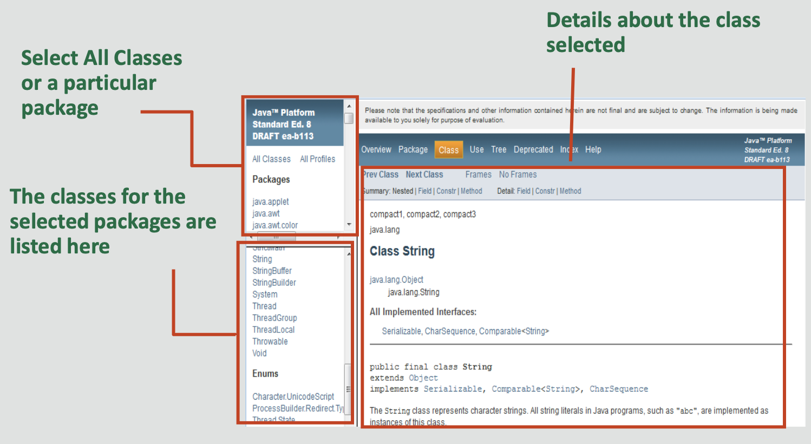
*In the screenshot, you can see the three main panels of the webpage.
The upper-left panel allows you to select a package. Java classes are organized in packages, but if you don’t know the package of a particular class, you can select All Classes.
The lower-left panel gives the list of classes in a package, or all classes if that’s what you selected. In this panel, the String class was selected, and the main panel on the right is populated with the details of the String class. The main panel contains a lot of information about the class, so you need to scroll down to access the information.*

## String Class Documentation: Method Summary
* **public int charAt(String str)**


*If you keep scrolling through the details of the String class, you will come to the list of methods (only a small subset of this list is shown here).
This master list of methods gives the basic details for the method. In this case, you can see that the name of the method is charAt, its type is char, and it requires an index parameter (of type int) to be passed in. There’s also a brief description that this method returns the char value at a particular index in the string. For each method, the method name and the parameter types are hyperlinked so that you can get more details.*

## String Class Documentation: Method Detail

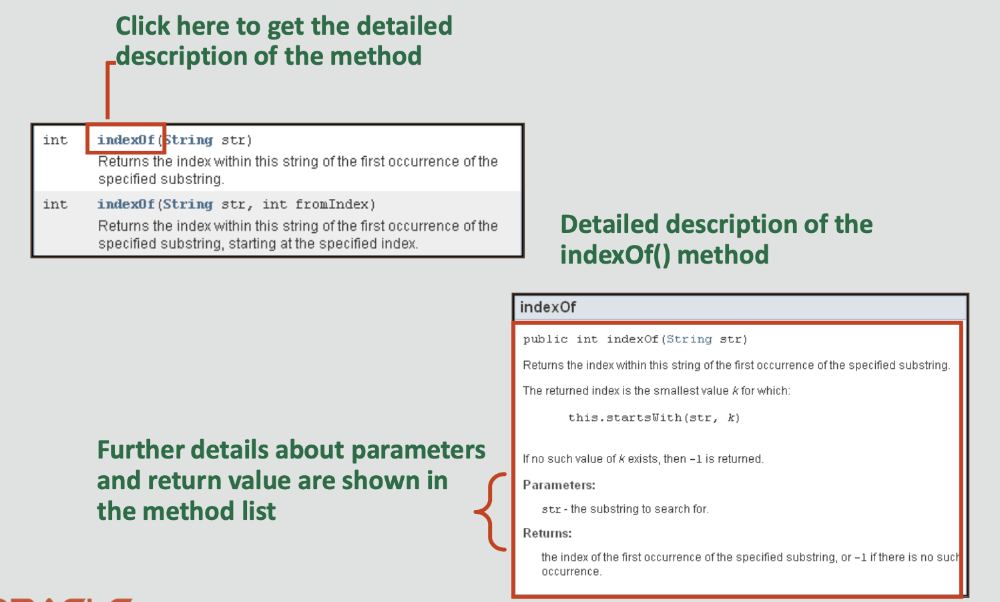

*For any of the methods, the method name and the parameter types are hyperlinked so that you can get more details. The example here shows the detailed description for one of the indexOf() methods of String.*

## String Methods: length
* **You can compute the length of a string by using the length method defined in the String class:**

	- Method: name.length()
	- Returns the length, or the number of characters, in name as
an integer value
* **Example:**

```
String name = "Mike.W"; 
System.out.println(name.length()); //6
```

## Accessing Each Character in a String
* **You can access each character in a string by its numerical index**
* **The first character of the string is at index 0, the next is at index 1, and so on**
* **For example:**
* **String str = "Hello, World";**

	- str has 0 to 11 indexes; that is, between 0 to str.length()-1

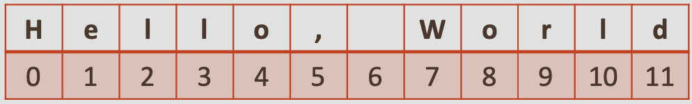

## String Methods: indexOf()
* **Each character of a string has an index**
* **You can retrieve the index value of a character in the string by using the indexOf method:**

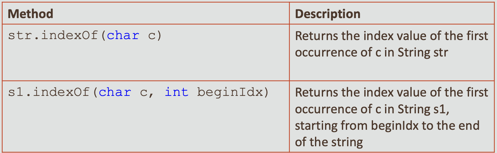

## String Methods: indexOf()
```
public static void main(String args[]){
       String phoneNum = "404-543-2345";
       int idx1 = phoneNum.indexOf('-');
       
       System.out.println("index of first dash: "+ idx1); //3
       
       int idx2 = phoneNum.indexOf('-’, indx1+1);
       System.out.println("second dash idx: "+ idx2); // 7
       
}//end method main
```

## String Methods: charAt
* **Returns the character of the string located at the index passed as the parameter**
* **Method: str.charAt(int index)**

```
String str = "Susan"; 
System.out.println(str.charAt(0)); //S 
System.out.println(str.charAt(3)); //a
```

## String Methods: substring()
* **You can extract a substring from a given string**
* **Java provides two methods for this operation:**

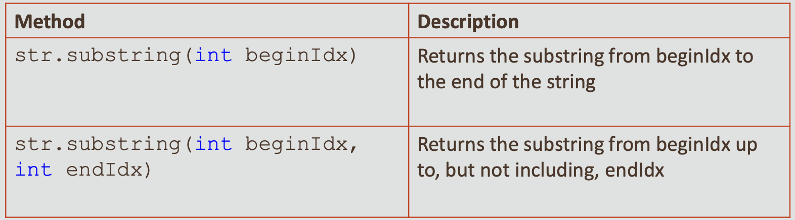

## String Methods: substring()
```
public static void main(String args[]){
String greeting = "Hello, World!";
String sub = greeting.substring(0, 5); → "Hello" 
String w = greeting.substring(7, 11); → "Worl" 
String tail = greeting.substring(7); → "World!"
}//end method main
```
## String Methods: replace()
* **This method replaces all occurrences of matching characters in a string**
* **Method: replace(char oldChar,char newChar)**
* **Example:**

	- Output: Using String Replace to Replace ChaRacteR
	- All occurrences of a lowercase “r” are replaced with a capital "R"

```
public static void main(String args[]) {
  String str = "Using String replace to replace character"; 
  String newString = str.replace("r", "R"); 
  System.out.println(newString);
}//end method main
```

## String Methods: replaceFirst()
* **This method replaces only the first occurrence of a matching character pattern in a string**
* **Method: replaceFirst(String pattern, String replacement)**

## String Methods: replaceFirst()
* **Example:**

```
public static void main(String args[]) {
   String replace = "String replace with replaceFirst"; 
   String newString = replace.replaceFirst("re", "RE");    
   System.out.println(newString);
}//end method main
```
* **Output:**

	- String REplace with replaceFirst
* **Only the first occurrence of "re" is replaced with "RE"**
* **The second occurrence isn’t changed**

## Exercise 1, Part 1
* **Import and open the StringsEx project**
* **Examine ShoppingCart.java**
* **Perform the following:**

	- Use the indexOf method to get the index for the space
character (" ") within custName
   - Assign it to spaceIdx
   - Use the substring method and spaceIdx to get the first name portion of custName
   - Assign it to firstName and print firstName

## Exercise 1, Part 2
* **You might notice that this project has two .java files with main methods**

  	- This could seem like a contradiction because we said never to write more than one main method!
  	
  	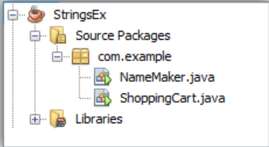
  	
* **Sometimes programmers do this when they're testing small bits of code and they want to keep all their files neatly in one project**  		
 	- Unfortunately, pressing run in NetBeans always runs the same file and never the others
 	- You'll have to right-click the alternate file you want to run, a menu will appear with an option to run that file

*Another option would be to enable the Run File button in NetBeans (or press Shift+F6). If this inconsistency is bad, please let us know and we'll try to correct it in the next version of the course.*

## Declaring and Creating a String
* **You can instantiate strings in two ways:**
* **String literals:**

	- Directly assign a string literal to a string reference
	
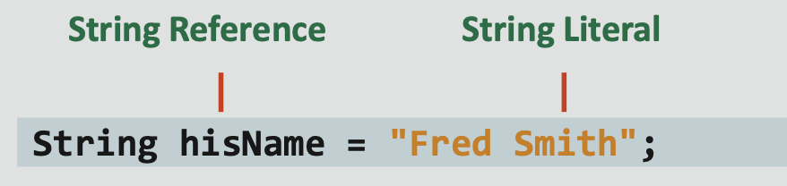

* **New operator:**

	- Similar to any other class
	- Not commonly used and not recommended

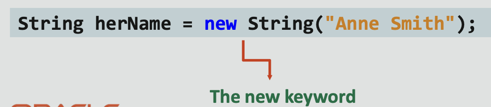

*Although you can use the new operator to create a string, don’t use it.*

## Strings Are Immutable
* **A String object is immutable; that is, after a String object is created, its value can’t be changed**
*  **Because strings are immutable, Java can process them very efficiently**

   - Consider the following:
  
   
   ```
   String str1 = "Hello";
String str2 = "Hello";
```
   - We expect this ...
   
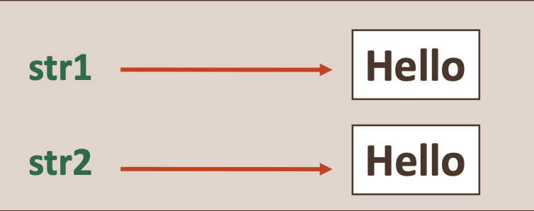

## Strings Are Immutable
* **But this is what happens ...**

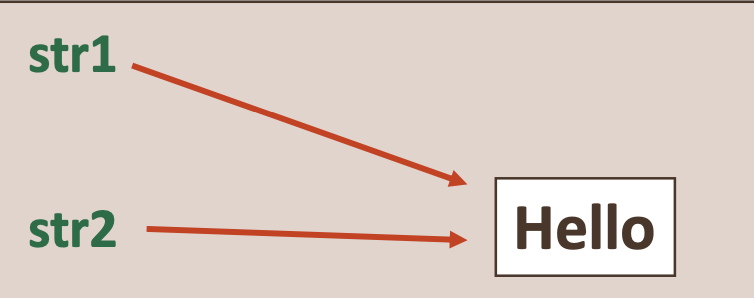

* **The Java runtime system knows that the two strings are identical and allocates the same memory location for the two objects**

## Concatenating Strings
* **In Java, string concatenation forms a new string that’s the combination of multiple strings**
* **You can concatenate strings in Java two ways :**

	-  +string concatenation operator
	- concat() method
	
## Using the + Operator (Before Concatenation)

```
public static void main(String args[]) {
    String s1 = "Susan";
    String s2 = "Roberts";
}//end method main
```
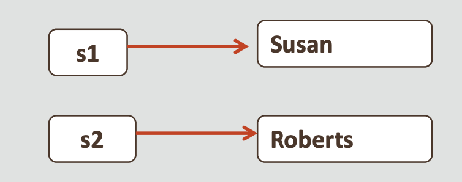

## Using the + Operator (After Concatenation)
```
public static void main(String args[]) { String s1 = "Susan";
   String s2 = "Roberts";
   S1 = s1 + s2;
   System.out.println(s1); 
}//end method main
```

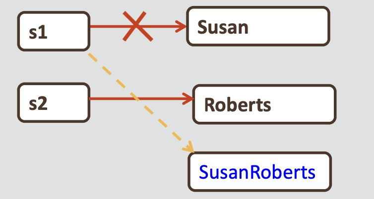

*After the string concatenation operation, a new String object, “SusanRoberts,” is created and s1 points to that because of the immutable property of Strings. Because there are no references to string, Susan is removed from memory.*

## Concatenating Non-String Data with String
* **If one of the operands is a string, Java automatically converts non-string data types to strings prior to concatenation**
* **Example:**

``` 
 public static void main(String args[]) {
    String newString = "Learning Java" + 8; 
    System.out.println(newString); // Learning Java 8
    
    System.out.println("Total : " + 8 + 8);//Total: 88
    System.out.println("Total : " + (8 + 8)) //Total: 16
    
    String numString1 = "8" + 8;
    System.out.println(newString1); // 88 
 }//end method main
 ```
 
*The slide example demonstrates concatenating a String literal and an integer by using the + operator. Java automatically converts non-String data types to strings before concatenation.*

*Output: Learning Java 8*

## Using the concat() Method (Before Concatenation)
```
  String myString = "Hello";
  myString = myString.concat(" World");
```
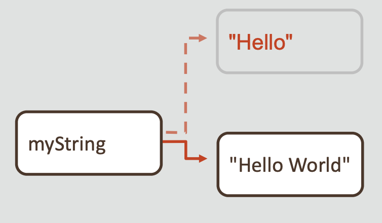

_In this example, the “World” string is being concatenated to the original string. The concat method is used here, but whether you use that or the concatenation operator (+), a new String object is created and the returned new String reference points to this new object.
In the diagram, the myString String reference no longer refers to “Hello,” and it will be removed from memory._

## Using the concat() Method (After Concatenation)
```
   String myString = "Hello";
   myString = myString.concat(" World"); 
   myString = myString + "!"
```

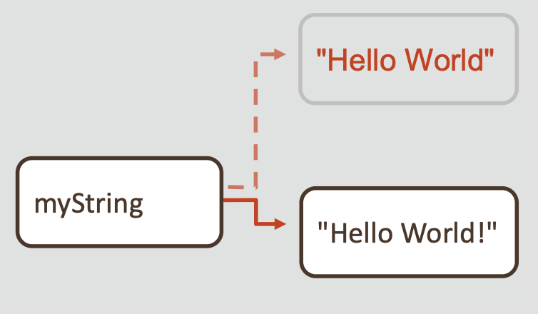

_In this example, after the concat method is called, a new object (HelloWorld) is created and the reference for this object is assigned to myString.
Finally, on concatenating another string, this time using the concatenation operator, the same thing happens again. A new object (HelloWorld!) is created and the reference for this object is assigned to myStrin_

## Exercise 2
* **Import and open the StringsEx project**
* **Examine NameMaker.java**
* **Perform the following:**

	- Declare String variables: firstName, middleName, lastName,
	  and fullName
	- Prompt users to enter their first, middle, and last names and read the names from the keyboard
	- Set and display the fullName as firstName+a blank char+middleName+a blank char+lastName
	
## Exercise 2
* **Which do you think is preferable for this scenario?** 
* **That is, the string concatenation operator or the concat() method?**

## What’s the Preferred Way to Concatenate Strings?
* **As you observed in the previous exercise:**
* **+ operator:**

	- Can work between a string and a string, char, int, double or
	  float data type value 
	- Converts the value to its string representation before concatenation
* **concat()method:**

	- Can be called only on strings 
	- Checks for data type compatibility, and a compile time error is produced if they don't match
	
## How Do You Compare String Objects?
* **You can compare two String objects by using the compareTo method**
* **This method compares based on the lexicographical order of strings**
* **Lexicographic comparisons are similar to the ordering found in a dictionary**
* **The strings are compared character by character until their order is determined or until they prove to be identical**
* **Syntax: s1.compareTo(s2)**
* **Returns an integer value that indicates
  the ordering of the two strings**
  
_Strings are compared lexicographically, not alphabetically. Lexicographic comparisons are similar to the ordering that one might find in a dictionary._

## Value Returned by compareTo()
* **The integer value returned by the compareTo() method can be interpreted as follows:**

	- Returns < 0 when then the string calling the method is lexicographically first
	- Returns == 0 when the two strings are lexicographically equivalent
	- Returns > 0 when the the parameter passed to the method is lexicographically first

## Using the compareTo Method
* **Let’s look at some examples:**

	- "computer".compareTo("comparison")
		     
    	- Returns an integer > 0 because the "comparison" parameter is
	  lexicographically first
	- "cab".compareTo("car")
	  
		- Returns an integer < 0 because the “cab” string calling the method is lexicographically first
	- "car".compareTo("car")
	
		- Returns an integer equal to 0 because both are lexicographically
		  equivalent

## Using the compareTo method: Example
* **Let’s write a program to compare names by using the compareTo method:**

```
public static void main(String[] args) {
    String s1 = "Susan";
    String s2 = "Susan";
    String s3 = "Robert";
    
    //Returns 0 because s1 is identical to s2 
    System.out.println(s1.compareTo(s2)); //Output is 0
    
   //Returns >0 because ‘S’ follows‘R’ 
   System.out.println(s1.compareTo(s3)); // Output is 1
   
   //Returns <0 because ‘R’ precedes ‘S’
   System.out.println(s3.compareTo(s1)); // Output is -1 
   
}//end method main
```

## Summary
* **In this lesson, you should have learned how to:**

	- Locate the String class in the Java API documentation 
	- Understand the methods of the String class 
	- Compare two String objects lexicographically
	- Find the location of a substring in a String object −Extract a substring from a String object
