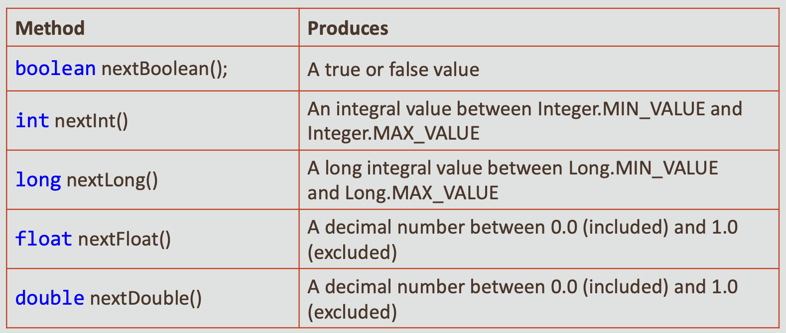

#  Java Foundations 4-4 The Random Class
## Objectives
* **This lesson covers the following objectives:**

    - Describe the purpose and uses of random numbers in Java programming
    - Identify methods of the Random class that obtain random numbers
    - Obtain random numbers in a range of numbers 
    - Understand the purpose of the
      random number seed
      
## Purpose of Random Number Generation in Java
* **A software application often needs to perform a task based on some randomly obtained value**
* **A number of applications need generation of random numbers**
* **Let’s look at some applications that use random number generation**

## Applications Based on Random Number Generation 
* **A card game application needs to shuffle a deck of cards randomly and then randomly distribute the cards to the players**
* **A lottery application requires a randomly generated number that’s based on an algorithm**

    - The person wins if his number matches the randomly generated number
    
## Generating Random Numbers in Java
* **So far in the previous lessons, you saw that Java comes with a variety of classes that support almost all basic application development features**
* **For example:**

    - String provides the capability for manipulating strings
    - Scanner provides capability for obtaining input from the console
* **Another important class in Java is the Random class that’s used to obtain random numbers**

## What Is the Random Class in Java?
* **In Java, you use the Random class to obtain random numbers**
* **The class is located in the java.util package**
* **It contains several methods that return randomly obtained integer, double, boolean, float, and long type values**

## How Do You Use the Random Class in a Java Program
* **Import the Random class from the java.util package**
* **Create an instance of the Random class, like this:**


## Methods Provided by the Random Class
* **You can obtain random values by invoking the following methods provided in the Random class:**



## How Do You Obtain a Random Number?
* **You can obtain a random number of integer type by using the nextInt method**
* **For example:**

```
import java.util.Random;
public class RandomNum {
   public static void main(String[] args) {
     Random rndNum = new Random();
     int randomNum = rndNum.nextInt(); 
     System.out.println("Random Number: " + randomNum);
  }//end method main 
}//end class RandomNum
```

*  **Output:**
   
Random Number: 1660093261

## How Do You Obtain a Series of Random Numbers?
* **You can obtain a series of random numbers by calling the nextInt method several times**


**Output:**
* Random Number 1: 1882639820 
* Random Number 2: -1976069676 
* Random Number 3: 1981623857 
* Random Number 4: 583773510 
* Random Number 5: 1679041043

## Generating Random Numbers of Double Type
* **You can obtain random numbers of double type by using the nextDouble method, like this:**
```
public class RandomDouble {
  public static void main(String[] args) {
    Random num = new Random();
    double randomDouble = num.nextDouble(); 
    System.out.println("Random Number: " + randomDouble);
   }//end method main
}//end class RandomDouble
```
* **In this example, the nextDouble method returns numbers of the type double in the range of 0.0 to 1.0**
  
**Output:**
  
Random Number: 0.4031547854609302

## Exercise 1
* **Import and open the RandomEx project**
* **Examine FlipCoin.java:**

  - Execute the following program and observe the random
    number that chance generated
  - If chance < 0.5, record the result as “heads”; else record the result as “tails”
  - Repeat this many times
  
## Generating Random Numbers in a Range of Numbers
* **So far, you have generated a random number within the range of an integer data type**
* **Sometimes, you may want to restrict the range of numbers that can be generated**
* **To implement this, you can use another version of the nextInt method:**

  - nextInt(int maxValue);
        
     - The argument determines the highest integer that can be obtained by
       the nextInt() method
     - You can obtain random positive numbers from 0 (included) to a maximum (excluded) of your choice
  
## Generating Random Numbers in a Range of Numbers: Example
* **Here’s an example that obtains random numbers in the range of 0 to 20:**

```
public class RandomNumRange {
  public static void main(String[] args) {
    Random num = new Random();
    int randomnum = num.nextInt(20); 
    System.out.println("Random Number: " + randomnum);
  }//end method main 
}//end class RandomNumRange
```

_In this example, the nextInt method returns an integer type value between 0 (inclusive) and 20 (exclusive). The randomly obtained returned number is then printed on the console screen._


_Output after first execution:_ 

_Random Number: 13_

_Output after second execution:_

_Random Number: 19_

## Generating a Range Starting from 1
* **To specify a range that starts with 1, add 1 to the result of the nextInt()method**
* **For example, to pick a number between 1 and 40 inclusively, add 1 to the result:**

```
Random rand = new Random();
int randomnum = rand.nextInt(40) + 1;
```

## Generating a Range Starting from a Higher Number Than 1
* **If the range starts from a higher number than 1:**

  - Subtract the starting number from the upper-limit number
    and then add 1
  - Add the starting number to the result of the nextInt() method
  
* **For example, to pick a number from 5 to 35, inclusively:**
  
  - The upper limit number will be 35-5+1=31 and 5 needs to be added to the result:
  
```
 Random rand = new Random();
 int randomnum = rand.nextInt(31) + 5;
```

## Program for Lottery Application

```
public class Lottery {
  public static void main(String[] args) {
    Scanner numberScanner = new Scanner(System.in); 
    System.out.print("Enter a number between 1 and 10: ");
    int userNum = numberScanner.nextInt();
    Random rnd = new Random();
    int winningNum = rnd.nextInt(10) + 1; 
    System.out.println("Your Number: " + userNumber); 
    System.out.println("The winning number is: " + winningNum);
  }//end method main 
}//end class RandomNumRange
```

_The example is a lottery program that lets the user input a series of integers and compares that number to a winning value. A random number is obtained in the range between 1 to 10 and is compared with the number entered by the user._

**Output:**

*Give me a number between 1 and 10: 9* 

_Your Number: 9_

_The winning number is: 1_

## Exercise 2
* **Import and open the RandomEx project**
* **Examine RockPaperScissor.java**

  - Perform the following:
  - Simulate the RockPaperScissor game by generating a random integer number in the range of 0 to 3
  - Compare the generated number with the following numbers: 
  - if number=0 : “rock”
  - if number=1: “paper”
  - if number=2: “scissors”
  - Record the result and repeat many times
  
## Is the Same Random Number Generated Every Time?
* **When you executed the previous examples multiple times, notice that the random number sequence is different each time**
* **Sometimes you may need to generate the same random number sequence every time**

## What Is a Seed of a Random Number?
* **You can achieve this by using a constant value called a seed**
* **When you create an instance of the Random class, pass a constant integer to specify the seed**


* **You can change the seed by calling the setSeed() method**
* **Each time you pass the same seed, the same random sequence is returned**

**Note:** Seed is a long number, represented as L

## Obtaining a Random Sequence by Using a Seed: Example

```
public static void main(String[] args) {
  Random rand = new Random(20L);
  System.out.println("Random Number 1: " + rand.nextInt(100)); 
  System.out.println("Random Number 2: " + rand.nextInt(100));
  System.out.println("Random Number 3: " + rand.nextInt(100));
  
  System.out.println("Changing seed to change to sequence"); 
  rand.setSeed(5L);
  System.out.println("Random Number 4: " + rand.nextInt(100)); 
  System.out.println("Random Number 5: " + rand.nextInt(100)); 
  System.out.println("Random Number 6: " + rand.nextInt(100));
  
  System.out.println("Setting seed 20 produce previous sequence"); 
  rand.setSeed(20L);
  System.out.println("Random Number 7: " + rand.nextInt(100)); 
  System.out.println("Random Number 8: " + rand.nextInt(100)); 
  System.out.println("Random Number 9: " + rand.nextInt(100));
}//end method main

```

**Output:**
* Random Number 1: 53
* Random Number 2: 36
* Random Number 3: 1

 Changing seed to change to sequence
* Random Number 4: 87
* Random Number 5: 92
* Random Number 6: 74

Setting seed 40 to produce the previous sequence 
* Random Number 7: 53
* Random Number 8: 36
* Random Number 9: 1

## Summary
* **In this lesson, you should have learned how to:**

  - Describe the purpose and uses of random numbers in Java programming
  - Identify methods of the Random class that obtain random numbers
  - Obtain random numbers in a range of numbers 
  - Understand the purpose of the random number seed