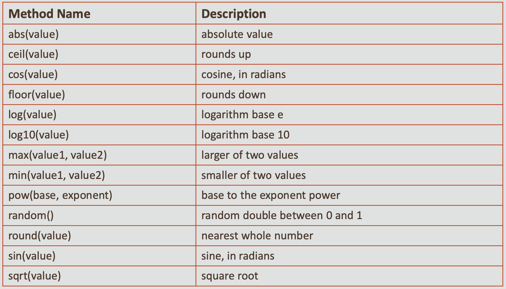
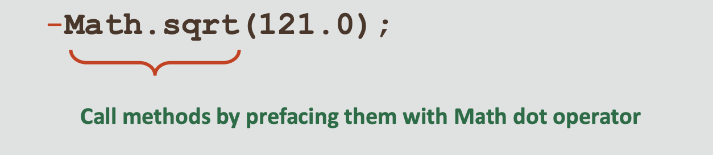
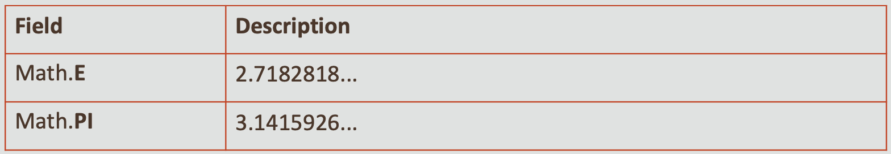
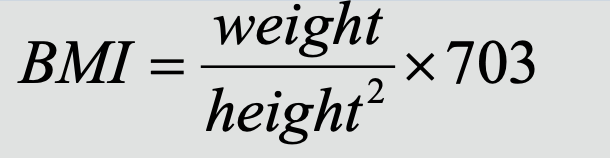

#  Java Foundations 4-5 The Math Class
## Objectives
* **This lesson covers the following objective:**
 
    - Understand the methods of the Math class
    - Use methods of the Math class to perform mathematical calculations
    - Use fields of the Math Class
    
## Performing Mathematical Calculations
* **While developing programs, you may need more advanced mathematical calculations than what the basic Java math operators provide**
* **For example:**
    - Finding the maximum or minimum of two values − Rounding values
    - Logarithmic functions
    - Square root
    - Trigonometric functions
    
* **The Java Math class contains methods for performing mathematical calculations**

## The Math Class
* **Is one of the many classes included in the Java class libraries**
* **Contains methods that perform various mathematical functions**
* **Is part of the java.lang package**

## Documentation for the Math Class
* **You can access the documentation from here:**

    - [documentation](http://docs.oracle.com/javase/8/docs/api/index.html)
    
## Exercise 1
* **Examine the Math class documentation:**

    - Standard Edition for Java SE 8:
    
        - [Java SE 8](http://docs.oracle.com/javase/8/docs/api/)
    
* **See if you can find a value for PI and a method for computing the square root of a number**    

## Some of the Methods Available in Math Class



## What's Different About the Math Class?
* **The methods of the Math class are static methods**
* **Static methods can be invoked through the class name**
* **That means you don’t have to create an object of the Math class to call the methods**
* **For example, to invoke the methods of the Random class, you have to create an object of the Random class like this:**

```
Random rndNum = new Random();
int randomNum = rndNum.nextInt();
```

## How Do You Call the Methods of the Math Class?
* **You can call methods of the Math class without creating an instance of the Math class, like this:**
* **Syntax:**

    - Math.methodName(parameters)
    
* **Example:**



## Calling a Method and Observing Its Result
* **Let’s see an example of calling a method and observing its result:**

```
public static void main(String[] args) {
  Math.sqrt(121.0); 
}//end method main
```

* **Observe the output:**

    - No output is displayed
    - Simply calling these methods produces no visible result
    
## How Do the Methods of the Math Class Work?
* **The Math methods don’t print the results to the console**
* **Each method returns a numerical result**
* **The returning value is more flexible than printing**
* **You can store, print, or combine it with a larger expression**

## Storing and Printing the Results
* **To see the result, you must print it or store it in a variable**
* **For example:**

    - Print the result:
  
```
public static void main(String[] args) { 
   System.out.println("Square root: " + Math.sqrt(121.0)); //11.0
}//end method main  
```
- Store the value:
```
public static void main(String[] args) {
  double sqroot= Math.sqrt(121.0);
  System.out.println("Square root: " + sqroot); //11.0
}//end method main
```

## Combining the Results
* **You can combine the results and use it in a larger expression, like this:**

```
public static void main(String[] args) {
  double result = Math.min(3, 7) + Math.abs(-50); 
  System.out.println("Result is " + result); //53
}//end method main
```

## Exercise 2
* **On paper, evaluate the following Java statements and record the results:**

    - Math.abs(-1.23)
    - Math.pow(3, 2)
    - Math.sqrt(121.0) - Math.sqrt(256.0) 
    - Math.abs(Math.min(-3, -5))
    
## Exercise 3
* **Consider an integer variable named age**
* **Use Math.max and Math.min methods to answer the following questions:**

    - What expression would replace negative ages with 0? 
    - What expression would limit the maximum age to 40?
    
**Answer**

What expression would replace negative ages with 0?

Math.max(age, 0)

What expression would limit the maximum age to 40?

Math.min(age, 40)

## Fields in the Math Class
* **The Math class contains two constant fields:**

    - PI and E
    


## PI Field
* **The Math class contains a constant, PI**
* **It contains a double value:**

    - 3.14159265358979323846
    
* **Remember, Math class methods are static methods and are accessed by using the Math class name**
* **Similarly, PI is a static variable in the Math class, and it is accessed by using the Math class name**
* **To use PI in a program, specify the class name (Math) and PI, separated by the dot operator:**

    -  Math.PI
    
## Calculating the Area of a Circle
* **Suppose that you have to write a Java program to compute the area of a circle**
* **Here’s the formula to compute the area of a circle:**

    - Area = PI* radius* radius
    - Where PI is a constant (approximately 3.1416)
    
## Computing the Area of a Circle
* **Using the Math.PI field for calculating the area yields a more accurate result than using a constant value for pi like 3.14**

```
public class AreaOfCircle {
  public static void main(String args[]) {
  Scanner sc = new Scanner(System.in); 
  System.out.print("Enter the radius: ");
  double radius = sc.nextDouble();
  double area = Math.PI * radius * radius; 
  System.out.println("The area of circle is: " + area);
  }//end method main
}//end class AreaOfCircle
```

**Output:**

Enter the radius: 7.5

The area of circle is: 176.71458676442586

## Exercise 4
* **A person’s body mass index (BMI) is computed like this:**



* **Import and open the MathEx project**
* **Examine _ComputeBMI.java_**
* **Write a program that computes the BMI and rounds off the BMI**

## Exercise 4
* **Use the methods of the Math class and display the output as:**

    - Enter the weight in pounds: 132.5 
    - Enter the height in inches: 62.5 
    - Your Body Mass Index is 24
    
## Summary
* **In this lesson, you should have learned how to:**

     - Understand the methods of the Math class
     - Use methods of the Math class to perform mathematical calculations
     - Use fields of the Math Class

