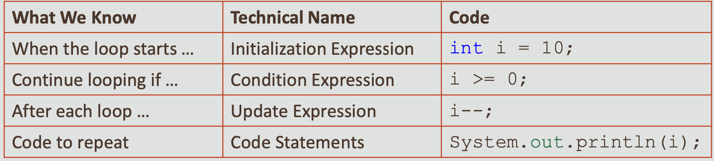
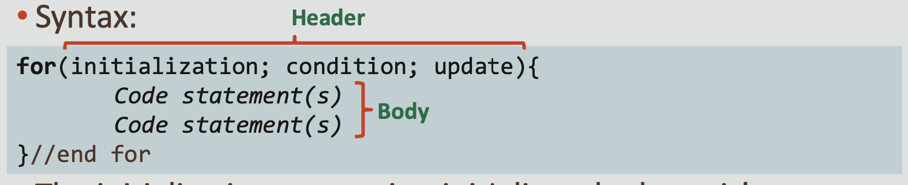
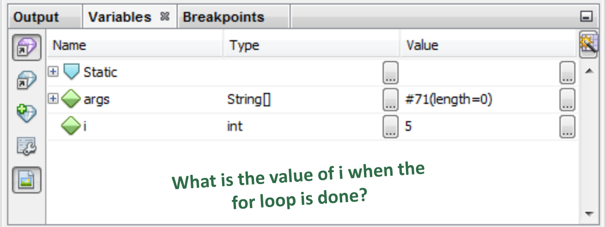

#  Java Foundations 6-1 for Loops

## Objectives:
* **This lesson covers the following objectives:**

    - Understand the components of the standard for loop 
    - Understand how to create and use a for loop 
    - Understand variable scope
    - Understand debugging techniques 
    - Explain how infinite loops occur in Java
    
## Mission to Saturn’s Rings
* **We’re going to launch a rocket ship**
* **Its mission is to study Saturn’s rings**
* **Do you have any thoughts on how to program a countdown timer?**

## The Countdown
* **Counting down from 10 requires 10 lines of code**

```
System.out.println("Countdown to Launch: "); 
System.out.println(10); 
System.out.println(9); 
System.out.println(8); 
System.out.println(7); 
System.out.println(6); 
System.out.println(5); 
System.out.println(4); 
System.out.println(3); 
System.out.println(2); 
System.out.println(1); 
System.out.println("Blast Off!");
```

## The Countdown
* **Counting down from 100 would require 100 lines of code**
* **That would be painful and tedious to program.**
* **Is there a more practical way to write this program?**
* **Can the code easily accommodate any starting value?**

## The Countdown

```
System.out.println("Countdown to Launch: "); 
System.out.println(100); System.out.println(99); 
System.out.println(98); System.out.println(97); 
System.out.println(96); System.out.println(95);
...
...
...
...
...
...
System.out.println(2); 
System.out.println(1);
System.out.println("Blast Off!");
```

## Can Variables Help?
* **Variables are somewhat helpful**
* **But we still have to copy and paste the same lines of code until 0 prints**

```
System.out.println("Countdown to Launch: ");

int i = 10;
System.out.println(i);
i--;
System.out.println(i);
i--;
System.out.println(i);
i--;
...
System.out.println("Blast Off!");
```

## Repeating Code
* **Can we make the same lines of code repeat a variable number of times?**
* **Lines 7–10 show the block of code we want to repeat**
* **Remember the line-by-line nature of programs:**

    - When the program reaches line 10 ...
    - We want to loop back to line 7
```
5.  int i = 10;
6. 
7. {
8. System.out.println(i); 
9. i--;
10. }
```

## Loop Statements
* **Loop statements are used to repeat lines of code.**
* **Java provides three types of loops:**

    - for
    - while
    - do-while
    
## Repeating Behavior

```
while (!areWeThereYet) {
  read book;
  argue with sibling;
  ask, "Are we there yet?";
}
Woohoo!;
Get out of car;
```

_A common requirement in a program is to repeat a number of statements. Typically, the code continues to repeat the statements until something changes. Then the code breaks out of the loop and continues with the next statement._

_The pseudocode example shows a while loop that loops until the areWeThereYet boolean is true._

## Loops
* **Loops are used in programs for repeated execution of one or more statements until a terminating condition is reached**

    - Until an expression is false
        
        - or
    - For a specific number of times:
    
        - I want to print the numbers from 1 to 10
        - I want to compute the sum of numbers in a given range
    
* **A for loop executes a known number of times**

    - for loops are also called definite loops
    
_In programming, there are times when you want to work with multiple inputs, but you want to execute the same logic for each input item._

_Loops start at the beginning of a piece of code, execute the logic, and then return to the beginning of the loop with new input, ready to execute the code again._

## What We Know
* **In the Countdown scenario, here’s what we know:**



## for Loop Overview
* **Syntax:**



* **The initialization expression initializes the loop, it’s executed only once, as the loop begins**
* **When the condition expression evaluates to false, the loop terminates**
* **The update expression is invoked after each iteration through the loop, this expression can increment or decrement a value**
* **Each expression should be separated with a semicolon (;)**

## Initialization Expression
* **Performed once as the loop begins**
* **Tells the compiler what variable (called a loop counter) is used in the loop**
* **Can start at any value, not just 10**

```
System.out.println("Countdown to Launch: ");
for(int i = 10; i >= 0; i--) { 
       System.out.println(i);
}//end for 

System.out.println("Blast Off!");
```

## Condition Expression
* **Looping continues as long as this boolean expression is true**
* **It uses comparison operators:**

    - (==, !=, <, >, <=, >=)
    
```
System.out.println("Countdown to Launch: ");
for(int i = 10; i >= 0; i--) { 
       System.out.println(i);
}//end for 
System.out.println("Blast Off!");
```

## Update Expression
* **This statement is executed after each iteration of the for loop**
* **It’s used to update the loop counter**

```
System.out.println("Countdown to Launch: ");
for(int i = 10; i >= 0; i--) { 
       System.out.println(i);
}//end for 
System.out.println("Blast Off!");
```

## Exercise 1, Part 1
* **Import and open the ForLoopsEx project**
* **Set a breakpoint in Countdown.java and observe...**

    - How the for loop affects code execution
    - How the value of i changes
    


## Exercise 1, Part 2
* **Can you modify the code to count up from 0 to 5?**
* **Can you modify the code to count all even numbers from 0 to 20?**

## Do I Need the Update Expression?
* **What if I wrote my loop like this?**

```
for(int i = 10; i >= 0;  ) {
       System.out.println(i);
       i--; 
}//end for
```

* **This works, too!**
* **But you may not want to code this way, as your loops
  may become more complicated**
  
## Omitting Expressions in the for Loop
* **Each expression in the header is optional**
* **But there are risks when you omit an expression:**

    - No initialization:
    
        - No initialization is performed
        - There may be no loop counter
    - No condition:
    
        - The loop condition is always considered to be true
        - The loop is an infinite loop
    - No update:
        
        - No increment operation is performed
        - The loop counter keeps the same value
    
## Omitting All Expressions in the for Loop
* **Examine the following code:**

    - All three expressions in the for loop can be omitted
    - The loop repeats infinitely
    
```
for(;;){ 
     System.out.println("Welcome to Java");
}//end for
```

## Exercise 2
* **Import and open the ForLoopsEx project**
* **Execute InfiniteLoop.java and observe the output**
* **Modify the for loop in InfiniteLoop.java to print “Hello” five times**

## Multiple statements within a loop body
* **To execute multiple statements within a body ...**
* **Enclose the statements within a pair of curly braces**
* **Otherwise, only the first statement in the body is executed**

```
for(int i = 1; i <= 5; i++)
System.out.println(i);
System.out.println("second line");
```

* **Output:**

  
## One Use of the for Loop
* **The for loop provides a compact way to iterate over a range of values**
* **Repetition without the for loop:**

```
//Prints the square of 1 through 5
System.out.println("1 squared = " + 1 * 1);
System.out.println("2 squared = " + 2 * 2);
System.out.println("3 squared = " + 3 * 3);
System.out.println("4 squared = " + 4 * 4);
System.out.println("5 squared = " + 5 * 5);
```

* **Repetition with the for loop:**
```
for(int i = 1; i <= 5; i++){
       System.out.println("i squared = " + i * i);
}//end for
```

## i Is the Loop Counter
* **Every example we’ve seen relies on the loop counter**

```
for(int i = 1; i <= 5; i++){
       System.out.println("i squared = " + i * i);
}//end for
```

* **i can:**

    - Be printed
    - Have its value changed 
    - Be used in calculations
    
* **This is great for:**

    - Counting
    - Calculating values quickly
    
## Understanding Variable Scope
* **But i exists only within the for loop**

    - This is known as the scope of i
    - i no longer exists when the for loop terminates
    - If i is used to calculate values, we’ll never get those values out of the for loop
    
* **Did you observe i disappear when you debugged Countdown.java?**

```
for(int i = 1; i <= 5; i++){
        System.out.println("i squared = " + i * i);
}//end for
```

## Variable Scope: Example
* **Variable i declared in the for loop is a local variable and cannot be accessed outside the loop**
* **Compiler error is generated at line 8**


## Variable Scope Animation
* **Variables cannot exist before or outside their block of
  code**


## Another Use for Loops
* **Suppose you need to find the sum of many numbers**

    - Assume readInt()is a method that accepts input via Scanner
    
```
public class Add4Integers {
  public static void main(String[] args){
    println("This program adds four numbers."); 
        int n1 = readInt("Enter n1: ");
         int n2 = readInt("Enter n2: ");
         int n3 = readInt("Enter n3: ");
         int n4 = readInt("Enter n4: ");
         int total = n1 + n2 + n3 + n4;
         println("The total is " + total + ".");
   }//end method main
...
}//end class Add4Integers
```

## Another Use for Loops
* **This approach is cumbersome to program if you want to add 100 values**

```
int n1 = readInt("Enter n1: ");
int n2 = readInt("Enter n2: ");
int n3 = readInt("Enter n3: ");
int n4 = readInt("Enter n4: ");
  ...
int n100 = readInt("Enter n100: ");
int total = n1 + n2 + n3 + n4 +... + n100;
```
* **Can a for loop make this program shorter?**
* **Can a for loop help find the sum of a variable number
  of integers?**
  
## Using Scope with for Loops
* **This can be solved using ...**

     - A for loop
     - Variables of different scope
    
``` 
public static void main(String[] args){

    int final N = 100;
    int total = 0;
    println("This program adds " + N + " numbers.");
    
    for(int i = 0; i < N; i++){
    int value = readInt(" ? ");
         total += value; 
         
    }//end for
    println("The total is " + total + "."); 
}//end method main
```

## Scope
* **This can be solved using ...**

    - A for loop
    - Variables of different scope
    


## Exercise 3
* **Import and open the ForLoopsEx project**
* **ScopeTest.javais broken**
* **Can you fix it?**
* **You should get the following output**

    - 64 32 16 8 4 2 1
    - 0 1 2 3 4 5
    - 5 4 3 2 1 0
    - 2 4 8 16 32 64
    
## Variable Already Defined
* **i is created before the for loop**
* **Another i can’t exist within the same scope**
* **One of these variables needs a different name**


## Out of Scope
* **j can’t exist outside the scope where it was created**
* **A different j can be created if the scopes don’t overlap**


## Do I Need the Initialization Expression?
* **What if I wrote my loop like this?**

```
int i = 10;
for(; i >= 0; i--){
      System.out.println(i); 
}//end for
```

* **This works, too!**

    - But i exists outside the scope of the for loop
    - If i is only meant to be a loop counter, the variable is wasting memory
    - Keep the scope narrow (as small as possible)
    - Stray variables complicate code and increase the potential for
      
## Summary
* **In this lesson, you should have learned how to:**

    - Understand the components of the standard for loop 
    - Understand how to create and use a for loop 
    - Understand variable scope
    - Understand debugging techniques 
    - Explain how infinite loops occur in Java
